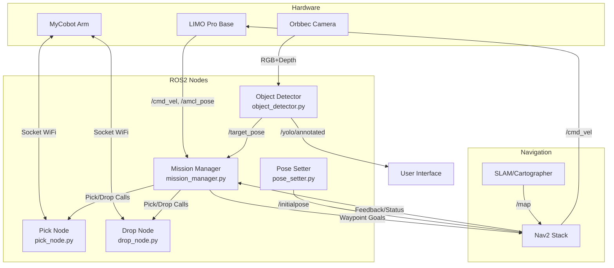

# 🏗️ System Architecture Diagram

This diagram shows how every part of the LIMO Cobot system fits together—hardware, ROS2 nodes, and data flow.  
Everything is modular, robust, and designed for easy debugging and upgrades.

## 🔍 Key Components Explained

### Hardware Layer
- **LIMO Pro Base**: The mobile platform providing autonomous navigation capabilities
- **MyCobot Arm**: 6-DOF robotic arm for object manipulation via WiFi control
- **Orbbec Camera**: RGB-D sensor for object detection and 3D perception

### ROS2 Node Layer
- **Mission Manager**: Orchestrates the entire workflow and coordinates between nodes
- **Object Detector**: YOLOv8-powered detection with 3D pose estimation
- **Pick Node**: Handles object grasping operations with the MyCobot arm
- **Drop Node**: Manages object placement and drop-off operations
- **Pose Setter**: Initial robot localization and pose management

### Navigation Stack
- **Nav2 Stack**: Advanced path planning and obstacle avoidance
- **SLAM/Cartographer**: Real-time mapping and localization

## 🔄 Data Flow Summary

1. **Mission Manager** sends waypoint goals to **Nav2**
2. **Object Detector** processes camera data and publishes target poses
3. **Navigation** moves the robot while avoiding obstacles
4. **Pick/Drop Nodes** execute manipulation tasks via WiFi
5. **Continuous feedback** ensures robust operation and error recovery
