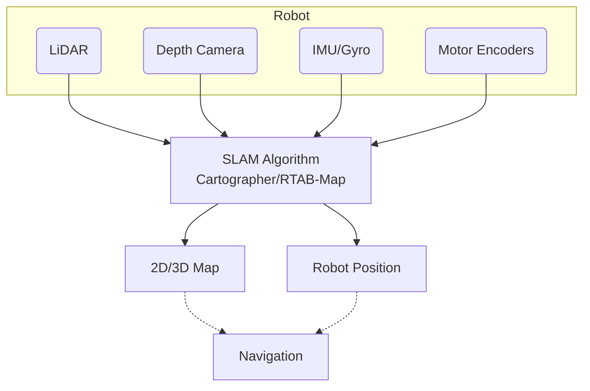

import Admonition from '@theme/Admonition';
import Tabs from '@theme/Tabs';
import TabItem from '@theme/TabItem';

# 🗺️ SLAM (Simultaneous Localization and Mapping)

SLAM is the core that allows your robot to **build a map of an unknown environment while keeping track of its own position**—all in real time.  
This is the foundation for autonomous navigation, exploration, and manipulation.

---

## 🤔 What is SLAM?

> **SLAM** stands for Simultaneous Localization and Mapping.  
It lets your robot create a map **and** know where it is on that map—using only its own sensors.

- **Localization:** "Where am I right now?"
- **Mapping:** "What does my world look like?"
- **SLAM:** "Where am I, and what does my world look like—at the same time?"

---

## 🧠 How SLAM Works (in Your Project)



- Your robot uses **LiDAR**, **depth camera**, and optionally **IMU/wheel odometry** for input.
- The **SLAM node** (Cartographer or RTAB-Map) creates a map and constantly estimates robot pose.
- The map and pose are published to other nodes (like Navigation).

---

## ⚙️ SLAM in This Project

You can choose between two industry-standard SLAM implementations:

<Tabs>
<TabItem value="cartographer" label="🎯 Cartographer (2D LiDAR)" default>

**Best for:** Fast, lightweight, real-time 2D mapping  
**Uses:** LiDAR (YDLIDAR T-mini Pro) for map building

```bash
# Launch robot base and LiDAR
ros2 launch limo_bringup limo_start.launch.py

# Start Cartographer SLAM
ros2 launch limo_bringup cartographer.launch.py
```

**Visualize in RViz:**
```bash
rviz2
```

</TabItem>
<TabItem value="rtabmap" label="🎥 RTAB-Map (3D RGB-D)">

**Best for:** High-quality, dense 3D mapping  
**Uses:** Depth camera (Orbbec DaBai) and LiDAR

```bash
# Start robot base and camera
ros2 launch limo_bringup limo_start.launch.py
ros2 launch orbbec_camera dabai.launch.py
# OR (for Astra camera):
ros2 launch astra_camera dabai.launch.py

# Start RTAB-Map SLAM
ros2 launch limo_bringup limo_rtab_slam.launch.py
```

RViz will show the real-time point cloud and map.

</TabItem>
</Tabs>

---

## 🗺️ Building and Saving a Map

<Tabs>
<TabItem value="cartographer-save" label="Cartographer" default>

1. **Move the robot** slowly throughout the environment (use teleop or remote/app)
2. **When done, save the map:**

```bash
ros2 run nav2_map_server map_saver_cli -f my_map
```

Map will be saved as `my_map.yaml` and `my_map.pgm` in the current directory.

<Admonition type="info" title="Map Files">
- **`.yaml`**: Map metadata (resolution, origin, thresholds)
- **`.pgm`**: Actual map image (grayscale occupancy grid)
</Admonition>

</TabItem>
<TabItem value="rtabmap-save" label="RTAB-Map">

- **RTAB-Map saves its database automatically** as `~/.ros/rtabmap.db` in your home folder
- **To backup or use later**, copy this file to a safe place!

```bash
# Backup your RTAB-Map database
cp ~/.ros/rtabmap.db ~/my_maps/office_map_$(date +%Y%m%d).db
```

<Admonition type="tip" title="Database Management">
RTAB-Map databases can get large (GB+). Regularly backup and clean old sessions.
</Admonition>

</TabItem>
</Tabs>

---

## 🎯 Localization Strategies

After a map is built, you need **localization** to allow the robot to "find itself" on the map at startup and during navigation.

### **AMCL (Adaptive Monte Carlo Localization)**
Used after Cartographer mapping. Tracks the robot's position on a 2D map using LiDAR and motion data.

```bash
ros2 launch limo_bringup limo_nav2.launch.py
# Or for Ackermann mode:
ros2 launch limo_bringup limo_nav2_ackmann.launch.py
```

### **RTAB-Map Localization**
Launch rtabmap in localization mode:

```bash
ros2 launch limo_bringup limo_rtab_slam.launch.py localization:=true
```

<Admonition type="tip" title="Initial Pose Setup">
In RViz, **always set the robot's initial pose** to align the laser scan with the map!  
Use the "2D Pose Estimate" tool in RViz after startup.
</Admonition>

---

## 🛠️ SLAM Configuration

### **Key Parameters for Cartographer**

| Parameter | Description | Typical Value |
|-----------|-------------|---------------|
| `map_resolution` | Map cell size (meters) | `0.05` |
| `tracking_frame` | Robot base frame | `base_link` |
| `published_frame` | Map frame | `map` |
| `use_odometry` | Use wheel odometry | `true` |

### **Key Parameters for RTAB-Map**

| Parameter | Description | Typical Value |
|-----------|-------------|---------------|
| `frame_id` | Robot base frame | `base_link` |
| `map_frame_id` | Map frame | `map` |
| `database_path` | Database location | `~/.ros/rtabmap.db` |
| `localization` | Localization mode | `false` (mapping) |

---

## 💡 Best Practices & Troubleshooting

<details>
<summary>🐌 **Move Slowly During Mapping**</summary>

- Move at **0.3 m/s or slower** for best accuracy
- Avoid sudden turns or rapid acceleration
- Give the algorithm time to process sensor data

</details>

<details>
<summary>🔄 **Loop Closure**</summary>

- Don't close loops too quickly—give the algorithm time to recognize previously seen areas
- Ensure good lighting for camera-based SLAM
- LiDAR-based SLAM is more robust to lighting changes

</details>

<details>
<summary>💾 **Data Management**</summary>

- **Backup your maps** and SLAM database after every successful session!
- Use descriptive filenames with dates: `office_2025-08-07.yaml`
- Test map quality before relying on it for navigation

</details>

<details>
<summary>⚠️ **Common Issues**</summary>

- **Laser scan and map don't align**: Manually set initial pose in RViz
- **Map quality poor**: Check sensor mounting, move slower, ensure good lighting
- **Localization fails**: Verify map files exist and are in correct format

</details>

---

## 🔧 Advanced SLAM Features

### **Multi-Session Mapping**
```bash
# Continue mapping with existing RTAB-Map database
ros2 launch limo_bringup limo_rtab_slam.launch.py 
# Database automatically loads previous session
```

### **Online Loop Closure**
- **Cartographer**: Automatic loop closure optimization
- **RTAB-Map**: Real-time loop closure with visual and geometric validation

### **Map Updates**
- **Static environments**: Maps remain stable over time
- **Dynamic environments**: RTAB-Map can handle moving objects

---

## 📊 Performance Comparison

| Feature | Cartographer | RTAB-Map |
|---------|-------------|----------|
| **Speed** | ⚡ Very Fast | 🐌 Moderate |
| **Map Quality** | 📏 Good 2D | 🎯 Excellent 3D |
| **Memory Usage** | 💾 Low | 💾 High |
| **Robustness** | 🛡️ Very Good | 🛡️ Excellent |
| **Setup Complexity** | 🔧 Simple | 🔧 Moderate |

---

## 📚 Learn More

- [Official ROS2 SLAM Tutorials](https://navigation.ros.org/tutorials/docs/navigation2_with_slam.html)
- [Cartographer Documentation](https://google-cartographer-ros.readthedocs.io/)
- [RTAB-Map Documentation](http://wiki.ros.org/rtabmap_ros)
- [Navigation Stack Integration](./navigation.md)

---

## 🎯 Next Steps

<Admonition type="note" title="Ready to Navigate?">

Once you have a good map, you're ready for autonomous navigation!

- **Next:** [Navigation & Path Planning](./navigation.md)
- **Integration:** [System Integration](./system-integration.md)
- **Backup:** [Backup & Restore](../03-environment-setup/backup-restore.md)

</Admonition>
