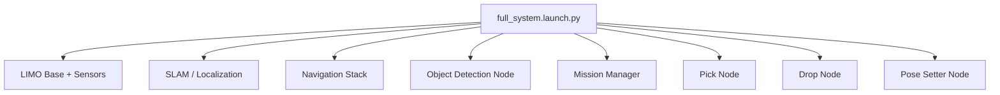

import Admonition from '@theme/Admonition';
import Tabs from '@theme/Tabs';
import TabItem from '@theme/TabItem';

# 🚀 Launch Files and System Bringup

See the [source code](https://github.com/krish-rRay23/LIMO_COBOT_PROJECT/tree/main/src) for implementation details.

The launch files in your project are the **blueprint** for starting all necessary ROS2 nodes in the correct order with the correct configuration.  
This ensures the robot, perception, navigation, and manipulation subsystems are fully operational with a single command.

---

## 🏗 Launch File Architecture

Your main entry point is:
```
full_system.launch.py
```

This launch file:
- Starts **drivers** (LIMO base, Orbbec depth camera, LiDAR)
- Starts **SLAM or localization**
- Launches **Navigation (Nav2)**
- Runs **Object Detection Node (YOLOv8)**
- Starts **Mission Manager**
- Brings up **Pick & Drop Nodes**
- Launches **Pose Setter**



---

## 🔄 System Bringup Logic

**Startup Sequence (simplified):**
1. **Drivers**  
   - Bring up robot base hardware
   - Initialize sensors (LiDAR, camera)
2. **SLAM / Localization**  
   - If mapping: start Cartographer/RTAB-Map  
   - If localizing: start AMCL with saved map
3. **Navigation Stack**  
   - Starts Nav2 servers (controller, planner, behavior tree)
4. **Perception**  
   - Launch object detector, subscribing to camera topics
5. **Coordination**  
   - Launch mission manager to handle state machine
6. **Manipulation**  
   - Launch pick/drop nodes and pose setter

<Admonition type="tip" title="Pro Tip">
Always check that drivers and sensors are running before bringing up perception and navigation.
</Admonition>

---

## ⚙️ Parameter Configuration

Launch files can load `.yaml` parameter files to configure:
- Navigation tuning (in `nav2_params.yaml`)
- SLAM settings
- YOLO detector thresholds
- Arm/gripper control parameters
- Base pose in Pose Setter

**Example parameter load in a launch file:**
```python
params_file = PathJoinSubstitution(
    [FindPackageShare('my_robot_bringup'), 'config', 'nav2_params.yaml']
)

Node(
    package='nav2_bringup',
    executable='bringup_launch.py',
    parameters=[params_file]
)
```

---

## 🛠 Debugging Launch Issues

**Common checks:**

1. **Is the workspace sourced?**
   ```bash
   source install/setup.bash
   ```

2. **Are topics active?**
   ```bash
   ros2 topic list
   ```

3. **Check launch output logs** for missing dependencies or parameter errors.

4. **Run subsystems individually** to isolate failures:
   ```bash
   ros2 launch limo_bringup limo_start.launch.py
   ros2 launch object_detector detector.launch.py
   ```

<Admonition type="warning" title="Watch Out">
Don't mix Foxy and Humble packages — they may cause runtime errors.
</Admonition>

---

## 🛠 Creating a Custom Launch File

If you want to modify the system bringup (e.g., skip mapping and go directly to localization):

### **1. Create new launch file in `launch/` directory:**
```python
from launch import LaunchDescription
from launch_ros.actions import Node

def generate_launch_description():
    return LaunchDescription([
        Node(package='pose_setter', executable='pose_setter_node'),
        Node(package='nav2_bringup', executable='bringup_launch.py'),
        Node(package='object_detector', executable='detector_node'),
        # Add/remove components as needed
    ])
```

### **2. Make it executable:**
```bash
chmod +x my_custom_launch.py
```

### **3. Run it:**
```bash
ros2 launch my_package my_custom_launch.py
```

---

## 📚 Learn More

- [ROS2 Launch System](https://docs.ros.org/en/foxy/Tutorials/Launch-system.html)
- [Nav2 Bringup Guide](https://navigation.ros.org/getting_started/index.html)
- [ROS2 Parameters](https://docs.ros.org/en/foxy/Tutorials/Parameters/Understanding-ROS2-Parameters.html)

---

## 🎯 Next Steps

- [Mission Manager Node](./mission-manager.md)
- [Pose Setter Node](./pose-setter.md)
- [System Integration](../04-core-concepts/system-integration.md)
