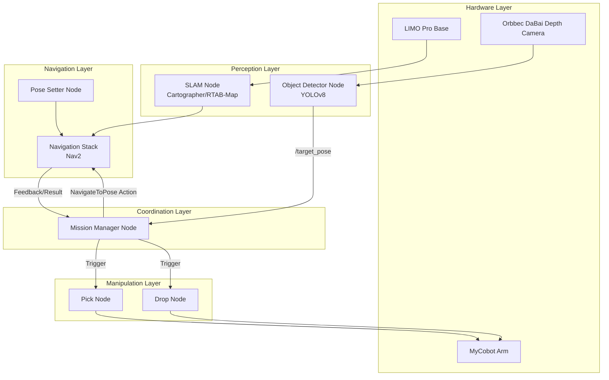

import Admonition from '@theme/Admonition';

# 🖥️ System Components Overview
See the [source code](https://github.com/krish-rRay23/LIMO_COBOT_PROJECT/tree/main/src) for implementation details.

Your LIMO Pro + MyCobot project is made up of **modular ROS2 nodes**, connected by topics, actions, and services.  
This architecture allows for **flexibility, fault isolation, and clear debugging**.

---

## 🏗️ System Architecture



---

## 🧩 Component Relationships

| Component         | Role                                                        | Key Dependencies                     |
|-------------------|-------------------------------------------------------------|---------------------------------------|
| **Object Detector** | Detects objects, outputs 3D poses                          | Camera, depth data, YOLO weights      |
| **SLAM Node**       | Builds/updates map, localizes robot                        | LiDAR, odometry, camera               |
| **Navigation Stack**| Plans paths & controls movement                            | Map from SLAM, goals from Mission     |
| **Pose Setter**     | Sets initial robot pose after startup                      | Map coordinates                       |
| **Mission Manager** | Main logic — coordinates detection, navigation, pick/drop | All other nodes                        |
| **Pick Node**       | Picks object using arm & gripper                           | MyCobot arm, target pose               |
| **Drop Node**       | Drops object at target location                            | MyCobot arm, predefined drop pose      |

---

## 🔄 Communication Flow

1. **SLAM Node**  
   - Publishes `/map`, `/odom`, `/tf`  
   - Used by Navigation for localization

2. **Object Detector Node**  
   - Subscribes to `/camera/color/image_raw` and `/camera/depth/image_raw`  
   - Publishes `/target_pose` (geometry_msgs/PoseStamped)

3. **Mission Manager Node**  
   - Subscribes to `/target_pose`  
   - Sends goals to Navigation via `/navigate_to_pose` action  
   - Calls Pick/Drop nodes when needed

4. **Pick & Drop Nodes**  
   - Receive triggers from Mission Manager  
   - Send movement/gripper commands to MyCobot

5. **Navigation Stack (Nav2)**  
   - Executes goals from Mission Manager  
   - Publishes feedback and result back to Mission Manager

---

## 🔌 Integration Points

| Integration Point          | Connected Components               | Purpose                                   |
|----------------------------|-------------------------------------|-------------------------------------------|
| `/target_pose`              | Detector → Mission Manager         | Trigger navigation to detected object     |
| `/navigate_to_pose` action  | Mission Manager → Navigation Stack  | Autonomous movement to location           |
| Arm control service/action  | Pick/Drop → MyCobot Arm             | Physical manipulation                     |
| `/map` & `/odom` topics     | SLAM → Navigation Stack             | Position tracking & path planning         |
| `/cmd_vel`                  | Navigation Stack → LIMO Base        | Direct velocity control                   |

---

## 💡 Best Practices

- Launch nodes **in correct order** (`full_system.launch.py` handles this)  
- Keep node responsibilities **separate** for easier debugging  
- Use **RViz** to visualize map, poses, goals, and detections in real time  
- Monitor topics with:
  ```bash
  ros2 topic list
  ros2 topic echo /target_pose
  ros2 action list
  ```

---

## 🎯 Next Steps

- [System Integration](../04-core-concepts/system-integration.md)
- [SLAM](../04-core-concepts/slam.md)  
- [Waypoint Navigation](../04-core-concepts/navigation.md)
- [Object Detection Pipeline](../04-core-concepts/object-detection.md)
