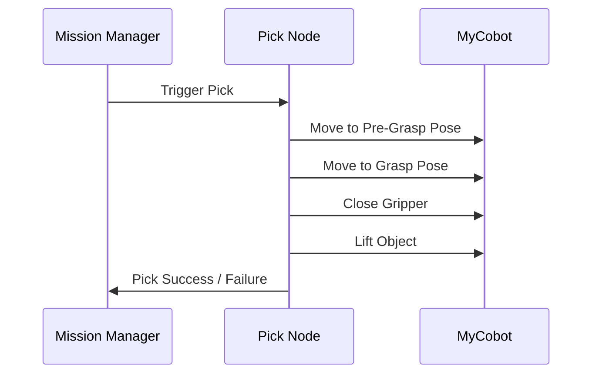

import Admonition from '@theme/Admonition';
import Tabs from '@theme/Tabs';
import TabItem from '@theme/TabItem';

# 🤖 Pick Node

See the [source code](https://github.com/krish-rRay23/LIMO_COBOT_PROJECT/tree/main/src) for implementation details.

The **Pick Node** controls the **MyCobot arm and gripper** to pick up objects once the robot reaches the target location.  
It integrates directly with the **Mission Manager Node** and executes a predefined pick sequence.

---

## 🔗 MyCobot Integration

The Pick Node communicates with the MyCobot arm over:
- **ROS2 topics/services** (if using mycobot_ros2 driver)
- **TCP/Wi-Fi API** (if using direct API control)

**Typical integration flow:**
1. Receive trigger from Mission Manager (`/pick_trigger` or action call)
2. Calculate pick position (from `/target_pose` or pre-defined offset)
3. Move arm to **pre-grasp** position (safe above object)
4. Lower arm to **grasp** position
5. Close gripper to grab object
6. Lift to **transport pose**
7. Send completion flag back to Mission Manager



---

## ✋ Gripper Control Mechanisms

The gripper can be controlled in two ways:

### **1. Position Command:**
- Send "open" or "close" angles directly
- Example: `gripper.publish(servo_angle)`

### **2. Service Call:**
- Use dedicated service: `/gripper_control` with commands `open` or `close`

**Example (pseudo-ROS2 code):**
```python
def close_gripper():
    self.gripper_pub.publish(Int16(100))  # Fully closed

def open_gripper():
    self.gripper_pub.publish(Int16(0))    # Fully open
```

---

## 🛡 Error Handling Procedures

| Error Case | Action Taken |
|------------|--------------|
| Arm fails to reach pose | Retry up to N times, log warning |
| Gripper fails to close/open | Retry with adjusted force, log error |
| Timeout on pick sequence | Abort pick, return failure to Mission Manager |
| Object slips after pick | Trigger re-grasp attempt if enabled |

<Admonition type="warning" title="Safety First">
Always implement a maximum number of retries to avoid damaging the arm or gripper.
</Admonition>

---

## 🧪 Testing & Verification

**Before live tests:**

1. **Simulation:** Test pick sequence in MoveIt2 or Gazebo without real hardware
2. **Dry Run:** Run arm sequence in the air (no object) to verify poses
3. **Slow Speed:** Run live test at reduced joint speeds for safety

**Verification checklist:**
- ✅ Arm moves to correct pre-grasp pose
- ✅ Arm descends vertically to grasp pose
- ✅ Gripper closes fully and holds object
- ✅ Arm lifts without collision

---

## 🛠 Troubleshooting Common Issues

| Symptom | Possible Cause | Solution |
|---------|---------------|----------|
| Arm stops mid-motion | Power or connection issue | Check MyCobot power & network |
| Gripper does not respond | Wrong topic/service name | Verify correct ROS2 topic/service |
| Pick position is off | Wrong transform or pose offset | Calibrate TF frames, adjust offsets |
| Object slips during lift | Low grip force or wrong gripper pose | Increase grip force or close fully |
| Node crashes when triggered | Missing parameter or bad message | Validate inputs before starting |

---

## 📚 Learn More

- [MyCobot ROS2 Docs](https://github.com/elephantrobotics/mycobot_ros2)
- [ROS2 Services & Actions](https://docs.ros.org/en/foxy/Tutorials/Services/Understanding-ROS2-Services.html)
- [MoveIt2 Manipulation](https://moveit.ros.org/documentation/)

---

## 🎯 Next Steps

- [Drop Node](./drop-node.md)
- [Mission Manager Node](./mission-manager.md)
- [Manipulation Basics](../04-core-concepts/manipulation.md)
