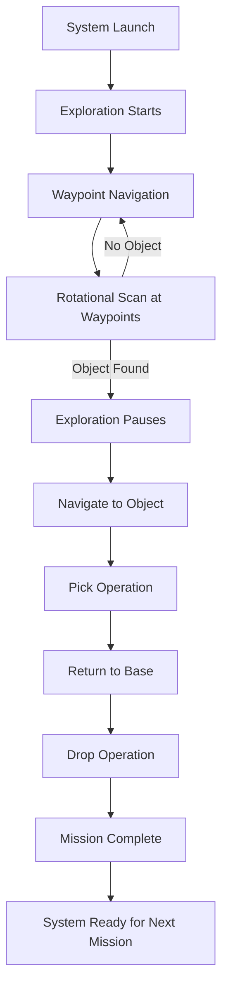

import Tabs from '@theme/Tabs';
import TabItem from '@theme/TabItem';
import Admonition from '@theme/Admonition';

# 🔄 Full Workflow

This section describes the **end-to-end operation** of the LIMO Autonomous System — from powering on to completing a pick-and-drop mission — including step-by-step actions, what to expect, and how to know each stage succeeded.

---

## 🗺 Complete System Workflow



---

## 📜 Step-by-Step Operation

<Tabs>
<TabItem value="1" label="1. Launch System">
- Power on **LIMO base**, **MyCobot arm**, and **camera**.
- Activate MyCobot Wi-Fi hotspot: **SSID:** `MyCobotWiFi2.4G` | **Password:** `mycobt123`.
- Launch:
```bash
ros2 launch nav_handler full_system.launch.py
```

**Expected logs:**
```
✅ Found MyCobot at 192.168.137.75
🟢 Exploration node ready.
✅ Initial pose published at (-0.78, -0.23, 0.14 rad)
```
</TabItem>

<TabItem value="2" label="2. Exploration & Navigation">
- Robot begins navigating through **fixed waypoints**.
- At each waypoint:
  - Stops.
  - Performs **270° rotational scan**.

**Success indicator:**
```
🔄 Starting scan: 270° at 0.5 rad/s
✅ Scan complete.
```
</TabItem>

<TabItem value="3" label="3. Object Detection">
- YOLO node processes RGB + depth frames.
- On detection:
  - Exploration pauses.
  - Voice alert: *"Object detected. Stopping exploration."*
  - Target pose published: `/target_pose`.

**Success indicator:**
```
[📍 DETECTED] target_object 2D(320,240) 3D(0.42,0.15,0.80)
🌍 POSE Published /target_pose → map(1.23, 0.45), yaw=45.0°
```
</TabItem>

<TabItem value="4" label="4. Navigate to Object">
- Nav2 moves robot to calculated **approach position**.

**Success indicator:**
```
🚀 Navigating to detected object.
🏁 Arrived at object location.
```
</TabItem>

<TabItem value="5" label="5. Pick Operation">
- Mission Manager runs `pick_node`.
- Arm sequence:
  - Center → Pickup → Grip → Return to Center.

**Success indicator:**
```
🤖 Moving to PICKUP...
🧲 Grabbed the object!
✅ Pick sequence complete!
```
</TabItem>

<TabItem value="6" label="6. Return to Base">
- Robot navigates to **BASE_POSE**.

**Success indicator:**
```
Pick done. Returning to base.
🏁 Goal reached.
```
</TabItem>

<TabItem value="7" label="7. Drop Operation">
- Mission Manager runs `drop_node`.
- Arm sequence:
  - Center → Drop Position → Release → Center.

**Success indicator:**
```
🪣 Dropped the object!
✅ Drop sequence complete!
```
</TabItem>

<TabItem value="8" label="8. Mission Complete">
- Voice alert: *"Mission complete."*
- Mission Manager state = `DONE`.

```
🏁 Mission done.
```
</TabItem>
</Tabs>

---

## 🎯 Expected Outputs at Each Stage

| Stage | Logs | Physical Action | Voice Feedback |
|-------|------|----------------|----------------|
| Launch | IP detection, pose publish | Robot idle | "Exploration initialized" |
| Exploration | Waypoint coords printed | Robot moves along path | "Navigating" |
| Scan | `🔄 Starting scan` | Robot rotates in place | "Scan complete" |
| Detection | `[📍 DETECTED] ...` | Robot stops | "Object detected" |
| Navigate to Object | `🚀 Navigating to detected object` | Robot approaches target | "Navigating to object" |
| Pick | `✅ Pick sequence complete!` | Arm grabs object | "Pick done. Returning to base" |
| Return | `🏁 Goal reached` | Robot moves to base | "Back to base" |
| Drop | `✅ Drop sequence complete!` | Arm releases object | "Drop done. Mission complete" |

---

## 🏆 Success Indicators

- ✅ Zero collisions during navigation.
- ✅ Accurate object approach (≤ 10 cm from calculated target).
- ✅ Pick & drop success rate ≥ 80% in test runs.
- ✅ All voice alerts match current operation stage.
- ✅ No critical errors in `mission.log`.

<Admonition type="tip" title="Pro Tip">
Run at least **3 consecutive missions** without failure to confirm system readiness for real-world deployment.
</Admonition>

---

## 🎯 Next Steps

- [Advanced Usage](../06-advanced-usage/custom-maps.md)
- [Monitoring](./monitoring.md)
- [Troubleshooting](../07-troubleshooting/common-errors.md)
