import Tabs from '@theme/Tabs';
import TabItem from '@theme/TabItem';
import Admonition from '@theme/Admonition';

# 🚀 System Startup

This section explains **how to start the entire LIMO Robotics System** in the correct order, with all required parameters, verification steps, and quick fixes for common startup issues.

---

## 🗂 Launch Order & Sequence

Your system is orchestrated by the **`full_system.launch.py`** file, which automatically:
1. Detects the **MyCobot arm's IP address** over Wi-Fi (`MyCobotWiFi2.4G` / `mycobt123`).
2. Starts **LIMO base bringup** (`limo_start.launch.py`).
3. Launches the **Orbbec DaBai camera**.
4. Starts **YOLO object detection** (`object_detector.py`).
5. Runs **Nav2** for navigation.
6. Publishes **initial robot pose** (`pose_setter.py`).
7. Starts the **Mission Manager** to coordinate exploration, detection, picking, and dropping.
8. Opens **RQT Image View** for real-time camera debugging.

<Tabs>
<TabItem value="auto" label="One-Command Launch">
```bash
ros2 launch nav_handler full_system.launch.py
```
</TabItem>
<TabItem value="manual" label="Manual Startup (Advanced)">
```bash
# 1️⃣ Start LIMO bringup
ros2 launch limo_bringup limo_start.launch.py

# 2️⃣ Launch Orbbec DaBai camera
ros2 launch orbbec_camera dabai.launch.py

# 3️⃣ Start YOLO object detection
ros2 run object_detector yolo_detector

# 4️⃣ Launch Nav2 with map
ros2 launch limo_bringup limo_nav2.launch.py map:=/path/to/map.yaml

# 5️⃣ Publish initial pose
ros2 run nav_handler pose_setter

# 6️⃣ Start mission manager
ros2 run nav_handler mission_manager
```
</TabItem>
</Tabs>

---

## ⚙️ Required Parameters

| Parameter | Default Value | Purpose |
|-----------|---------------|---------|
| `m5_ip` | Auto-detected or `192.168.137.75` | MyCobot control over Wi-Fi |
| `map` | `/home/agilex/krish_ws/maps/map11.yaml` | Pre-built navigation map |
| `waypoints` | Fixed set in `mission_manager.py` | Exploration path |
| `BASE_POSE` | (-0.07185, -0.08918, 7.95°) | Drop zone location |

💡 **Tip:** You don't need to manually set `m5_ip` if using the Wi-Fi hotspot method.

---

## ✅ Startup Verification Steps

After launch, you should see:

1. **LIMO bringup logs**:
   - `... LIMO base initialized`
2. **Camera logs**:
   - `✅ YOLO detector node initialized with synchronized inputs`
3. **Nav2 logs**:
   - `bt_navigator: Begin navigating...`
4. **Pose Setter logs**:
   - `✅ Initial pose published at (-0.78, -0.23, 0.14 rad)`
5. **Mission Manager logs**:
   - `🟢 Exploration node ready.`
6. **RQT Image View** shows:
   - Live camera feed with YOLO bounding boxes & 3D coords.

<Admonition type="tip" title="Voice Feedback">
The robot will speak key status updates:
- "Navigating"
- "Object detected"
- "Pick done. Returning to base."
- "Drop done. Mission complete."
</Admonition>

---

## 🛠 Common Startup Issues

| Issue | Cause | Fix |
|-------|-------|-----|
| `❌ Nav2 server not ready!` | Nav2 not fully initialized before mission manager starts | Increase `TimerAction` delay in `full_system.launch.py` |
| `YOLO detector not receiving camera frames` | Camera not connected or wrong topic names | Verify `dabai.launch.py` camera topics match in `object_detector.py` |
| Arm does not move | Wrong or unreachable `m5_ip` | Ensure Wi-Fi hotspot is active before launch |
| RQT Image View crashes | Missing `rqt_image_view` package | Install with `sudo apt install ros-foxy-rqt-image-view` |

---

## 🧠 Internal Flow

```mermaid
flowchart TD
    A["Launch full_system.launch.py"] --> B["Auto-detect MyCobot IP"]
    B --> C["LIMO Bringup"]
    C --> D["Camera Launch"]
    D --> E["YOLO Object Detection"]
    E --> F["Nav2 + Map Load"]
    F --> G["Pose Setter"]
    G --> H["Mission Manager"]
    H --> I["Exploration → Detection → Pick → Drop"]
```



---

## 🔍 Pre-Run Checklist

- ✅ MyCobot Wi-Fi hotspot ON (`MyCobotWiFi2.4G` / `mycobt123`)
- ✅ Map file exists at correct path
- ✅ ROS 2 workspace sourced (`source install/setup.bash`)
- ✅ LIMO battery charged (> 50%)
- ✅ Arm gripper unobstructed
- ✅ Camera lens clean

---

## 🎯 Next Steps

- [Mission Manager Overview](../05-system-components/mission-manager.md)
- [System Components](../05-system-components/overview.md)
- [Troubleshooting Guide](../07-troubleshooting/common-errors.md)
