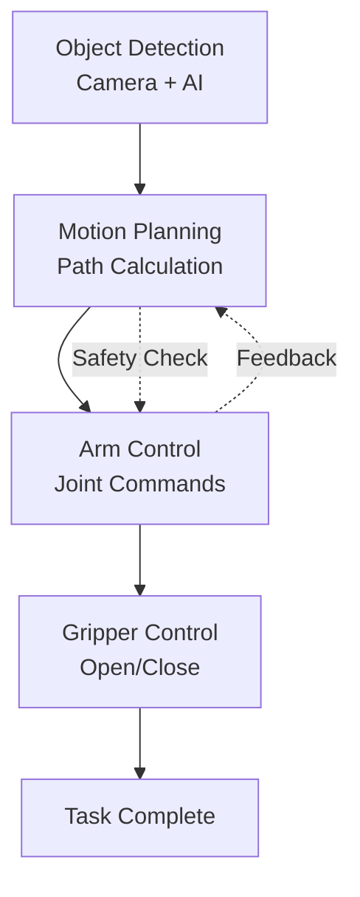
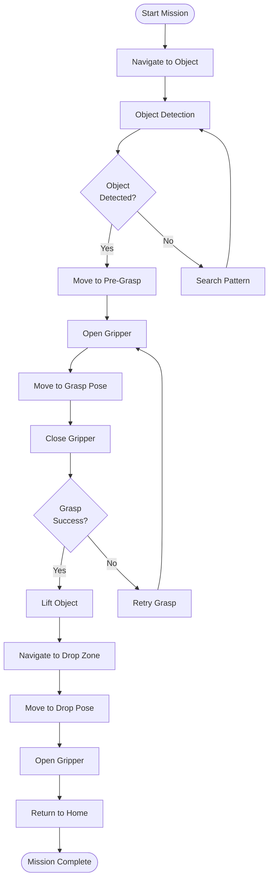
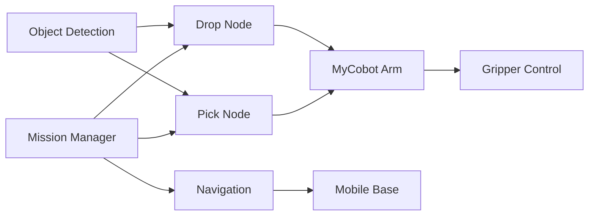

import Admonition from '@theme/Admonition';
import Tabs from '@theme/Tabs';
import TabItem from '@theme/TabItem';

# 🤖 Manipulation Basics

Robotic manipulation is the art and engineering of **controlling an arm and gripper** to interact with the physical world.  
In your project, manipulation allows your robot to **pick up, transport, and drop objects** with the MyCobot arm—enabling true autonomy.

---

## 🦾 Manipulation Fundamentals

**Manipulation** combines three key components:
- **Perception:** Detect object pose using sensors/cameras
- **Planning:** Calculate motions for reaching, grasping, and moving
- **Control:** Send joint or Cartesian commands to the arm and gripper



### **Key Concepts**

| Concept | Description | Example |
|---------|-------------|---------|
| **Forward Kinematics** | Joint angles → end-effector pose | "If joints are [30°, 45°, 60°], where is the gripper?" |
| **Inverse Kinematics** | End-effector pose → joint angles | "To reach (x, y, z), what joint angles needed?" |
| **Workspace** | Volume the arm can reach | Spherical region around robot base |
| **Singularities** | Arm configurations to avoid | Fully extended or folded positions |

---

## 🦿 Arm Control Strategies

In your LIMO + MyCobot project, control happens at several levels:

<Tabs>
<TabItem value="joint" label="Joint Control" default>

**Move each joint to a target angle**

```python
# Example joint control
joint_angles = [0.0, -90.0, 45.0, 0.0, 45.0, 0.0]  # degrees
mycobot.send_angles(joint_angles, speed=50)
```

**Pros:**
- ✅ Direct hardware control
- ✅ Fast execution
- ✅ Predictable motion

**Cons:**
- ❌ Requires manual calculation
- ❌ Hard to visualize end result

</TabItem>
<TabItem value="pose" label="Pose Control">

**Move the end effector (gripper) to a 3D pose**

```python
# Example Cartesian control
target_pose = [150, 100, 200, 0, 0, 0]  # [x, y, z, rx, ry, rz]
mycobot.send_coords(target_pose, speed=50, mode=0)
```

**Pros:**
- ✅ Intuitive positioning
- ✅ Direct spatial control
- ✅ Easy to visualize

**Cons:**
- ❌ May hit singularities
- ❌ Slower computation

</TabItem>
<TabItem value="sequence" label="Pick-and-Place Sequences">

**Pre-programmed or dynamic sequences**

```python
# Example pick sequence
def pick_object(object_pose):
    # 1. Move to pre-grasp pose (safe approach)
    pre_grasp = [object_pose[0], object_pose[1], object_pose[2] + 50, 0, 0, 0]
    mycobot.send_coords(pre_grasp, speed=30)
    
    # 2. Open gripper
    mycobot.set_gripper_state(0, speed=70)  # 0 = open
    
    # 3. Move to grasp pose
    mycobot.send_coords(object_pose, speed=20)
    
    # 4. Close gripper
    mycobot.set_gripper_state(1, speed=70)  # 1 = close
    
    # 5. Lift object
    lift_pose = [object_pose[0], object_pose[1], object_pose[2] + 100, 0, 0, 0]
    mycobot.send_coords(lift_pose, speed=30)
```

</TabItem>
</Tabs>

<Admonition type="info" title="Pro Tip">
Use WiFi connection for MyCobot for seamless control—your launch system auto-detects IP address for wireless operation.
</Admonition>

---

## ✋ Gripper Operations

The gripper is the "hand" of your robot, essential for object interaction:

### **Basic Gripper Commands**

```python
# Open gripper (prepare for pickup)
mycobot.set_gripper_state(0, speed=70)

# Close gripper (grasp object)
mycobot.set_gripper_state(1, speed=70)

# Partial grip (delicate objects)
mycobot.set_gripper_value(500, speed=70)  # 0-1000 range
```

### **Gripper Control Strategies**

| Strategy | Use Case | Example |
|----------|----------|---------|
| **Force Control** | Fragile objects | Eggs, glass, electronics |
| **Position Control** | Standard objects | Boxes, tools, bottles |
| **Adaptive Grip** | Unknown objects | Variable size/shape items |

### **Gripper Feedback**

```python
# Check if gripper is holding something
def is_gripping():
    current_value = mycobot.get_gripper_value()
    return current_value > 100  # Threshold for "holding"

# Verify successful grasp
def verify_grasp():
    if is_gripping():
        print("✅ Object grasped successfully")
        return True
    else:
        print("❌ Grasp failed - object not detected")
        return False
```

---

## 🚀 Pick and Place Workflow

<Tabs>
<TabItem value="sequence" label="Complete Sequence" default>

### **Full Pick and Place Operation**

1. **Navigate to object** (using waypoint navigation or real-time detection)
2. **Object detection** determines precise 3D pose of target
3. **Move arm to pre-grasp pose** (safe position above target)
4. **Open gripper** (prepare for pickup)
5. **Move down to grasp pose** (precise positioning)
6. **Close gripper** (secure object)
7. **Lift object** (move to safe transport pose)
8. **Navigate to drop location** (mobile base movement)
9. **Move arm to drop pose** (position over target)
10. **Open gripper** (release object)
11. **Return arm to home position** (safe storage pose)

</TabItem>
<TabItem value="diagram" label="Visual Workflow">



</TabItem>
<TabItem value="code" label="Implementation Example">

```python
class PickAndPlaceController:
    def __init__(self):
        self.mycobot = MyCobot('/dev/ttyUSB0', 115200)  # or WiFi
        self.navigator = NavigationController()
        self.detector = ObjectDetector()
        
    def execute_pick_and_place(self, object_type, drop_location):
        try:
            # Phase 1: Navigate and detect
            object_pose = self.find_object(object_type)
            if not object_pose:
                return False, "Object not found"
            
            # Phase 2: Pick operation
            success = self.pick_object(object_pose)
            if not success:
                return False, "Pick operation failed"
            
            # Phase 3: Transport and drop
            self.navigator.go_to_pose(drop_location)
            self.drop_object()
            
            return True, "Pick and place completed successfully"
            
        except Exception as e:
            self.emergency_stop()
            return False, f"Error: {str(e)}"
    
    def pick_object(self, object_pose):
        # Safety pre-grasp approach
        pre_grasp = [object_pose.x, object_pose.y, object_pose.z + 0.05, 0, 0, 0]
        self.mycobot.send_coords(pre_grasp, speed=30)
        time.sleep(2)
        
        # Open gripper
        self.mycobot.set_gripper_state(0, speed=70)
        time.sleep(1)
        
        # Move to grasp pose
        grasp_pose = [object_pose.x, object_pose.y, object_pose.z, 0, 0, 0]
        self.mycobot.send_coords(grasp_pose, speed=20)
        time.sleep(2)
        
        # Close gripper
        self.mycobot.set_gripper_state(1, speed=70)
        time.sleep(1)
        
        # Verify grasp and lift
        if self.verify_grasp():
            lift_pose = [object_pose.x, object_pose.y, object_pose.z + 0.1, 0, 0, 0]
            self.mycobot.send_coords(lift_pose, speed=30)
            return True
        else:
            return False
```

</TabItem>
</Tabs>

---

## 🔌 Integration with System Components

### **How Manipulation Fits In**



### **Node Communication**

| Node | Publishes | Subscribes | Services |
|------|-----------|------------|----------|
| **Pick Node** | `/arm/status` | `/detected_objects` | `/pick_object` |
| **Drop Node** | `/drop/status` | `/target_location` | `/drop_object` |
| **Mission Manager** | `/mission/status` | `/arm/status`, `/nav/status` | `/start_mission` |

---

## 🛠️ Configuration and Calibration

### **Arm Workspace Definition**

```python
# MyCobot 280 workspace limits
WORKSPACE_LIMITS = {
    'x_min': -280, 'x_max': 280,      # mm
    'y_min': -280, 'y_max': 280,      # mm  
    'z_min': -131, 'z_max': 412,      # mm
    'reach_radius': 280               # mm
}

def is_pose_reachable(target_pose):
    distance = math.sqrt(target_pose.x**2 + target_pose.y**2)
    return (WORKSPACE_LIMITS['x_min'] <= target_pose.x <= WORKSPACE_LIMITS['x_max'] and
            WORKSPACE_LIMITS['y_min'] <= target_pose.y <= WORKSPACE_LIMITS['y_max'] and
            WORKSPACE_LIMITS['z_min'] <= target_pose.z <= WORKSPACE_LIMITS['z_max'] and
            distance <= WORKSPACE_LIMITS['reach_radius'])
```

### **Safety Parameters**

```yaml
# manipulation_config.yaml
manipulation:
  safety:
    max_speed: 50          # 0-100 scale
    approach_speed: 20     # Slower for precision
    emergency_stop: true   # Enable e-stop
    
  timeouts:
    move_timeout: 10.0     # seconds
    grasp_timeout: 3.0     # seconds
    
  retry_policy:
    max_attempts: 3
    retry_delay: 1.0       # seconds
```

---

## 💡 Best Practices & Troubleshooting

### **Safety Guidelines**

<Admonition type="warning" title="Safety First!">
- Always move to **pre-grasp poses** before attempting pickup
- Use **timeouts** and feedback to handle failures
- Test sequences in **simulation** or with arm "in the air" first
- Ensure arm is at **home position** before/after sessions
</Admonition>

### **Common Issues & Solutions**

<details>
<summary>🔧 **Arm Won't Move**</summary>

**Possible causes:**
- Power/connection issues
- Joint limits exceeded
- Emergency stop activated

**Solutions:**
```python
# Check connection
if mycobot.is_controller_connected():
    print("✅ Controller connected")
else:
    print("❌ Connection failed")
    
# Reset arm position
mycobot.send_angles([0, 0, 0, 0, 0, 0], speed=30)

# Clear any error states
mycobot.release_all_servos()
time.sleep(1)
mycobot.power_on()
```

</details>

<details>
<summary>🤏 **Grasp Failures**</summary>

**Common causes:**
- Object too small/large for gripper
- Incorrect approach angle
- Object slipping during pickup

**Improvements:**
```python
# Adaptive grasp strategy
def adaptive_grasp(object_size):
    if object_size < 20:  # Small objects
        gripper_value = 200
        approach_speed = 10
    elif object_size > 50:  # Large objects
        gripper_value = 800
        approach_speed = 30
    else:  # Medium objects
        gripper_value = 500
        approach_speed = 20
    
    mycobot.set_gripper_value(gripper_value, speed=70)
```

</details>

<details>
<summary>⚡ **Performance Optimization**</summary>

**Speed up operations:**
- **Pre-plan common poses** for faster execution
- **Use joint space** for non-critical movements
- **Optimize gripper timing** based on object type
- **Parallel processing** where safe (navigation + arm planning)

```python
# Pre-defined poses for efficiency
COMMON_POSES = {
    'home': [0, 0, 0, 0, 0, 0],
    'ready': [0, -45, 45, 0, 0, 0],
    'scan': [0, -30, 30, 0, -60, 0]
}

def quick_move_to_pose(pose_name):
    if pose_name in COMMON_POSES:
        mycobot.send_angles(COMMON_POSES[pose_name], speed=50)
    else:
        print(f"Unknown pose: {pose_name}")
```

</details>

---

## 🎯 Advanced Manipulation Features

### **Vision-Guided Grasping**

```python
def vision_guided_pick(self, object_class):
    # Get object pose from camera
    detection = self.object_detector.detect(object_class)
    
    if detection:
        # Convert camera coordinates to arm coordinates
        arm_pose = self.transform_pose(detection.pose)
        
        # Adjust for object orientation
        grasp_angle = self.calculate_grasp_angle(detection.orientation)
        arm_pose.rotation = grasp_angle
        
        return self.pick_object(arm_pose)
    return False
```

### **Collaborative Operation**

```python
class CollaborativeManipulation:
    def __init__(self):
        self.human_detector = HumanDetector()
        self.safety_zone = SafetyZone(radius=0.5)  # 50cm safety buffer
        
    def safe_manipulation(self, target_pose):
        if self.human_detector.human_in_workspace():
            self.pause_and_wait()
        else:
            self.execute_manipulation(target_pose)
```

---

## 📚 Learn More

- [MyCobot Official Documentation](https://docs.elephantrobotics.com/docs/gitbook-en/)
- [ROS2 Manipulation Tutorials](https://moveit.picknik.ai/humble/index.html)
- [MoveIt2 Motion Planning](https://moveit.ros.org/)
- [Robotic Grasping Fundamentals](https://robotics.northwestern.edu/documents/Grasping.pdf)

---

## 🎯 Next Steps

<Admonition type="note" title="Ready for Integration?">

Now that you understand manipulation basics:

- **Implementation:** [Pick & Drop Nodes](../system-components/pick-node.md)
- **Integration:** [System Integration](./system-integration.md)
- **Advanced:** [Custom Object Detection](../advanced-usage/custom-objects.md)
- **Troubleshooting:** [Manipulation Issues](../troubleshooting/common-errors.md)

</Admonition>
