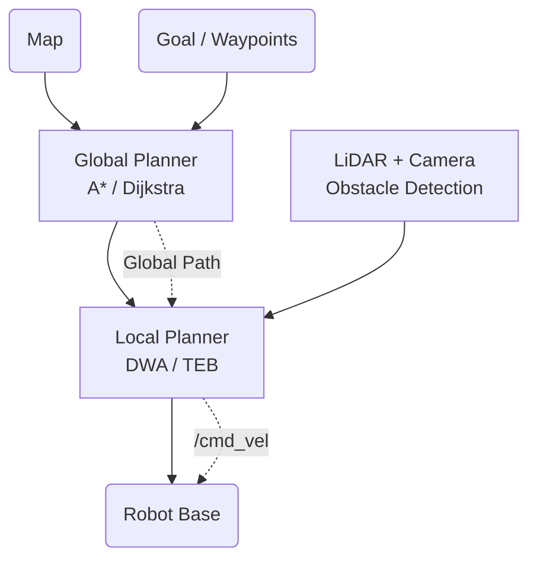
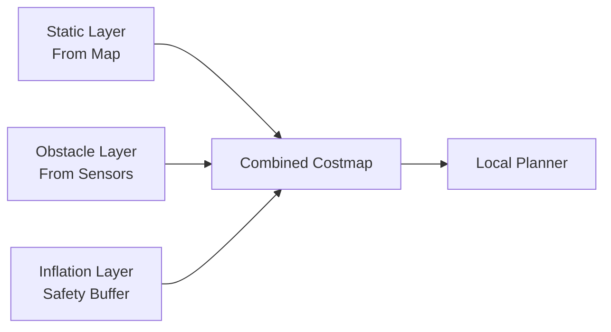

import Admonition from '@theme/Admonition';
import Tabs from '@theme/Tabs';
import TabItem from '@theme/TabItem';

# 🚗 Waypoint Navigation

Navigation is what lets your robot **move autonomously to precise locations**—even in dynamic, obstacle-filled environments.  
This section explains how your project achieves robust, safe, and intelligent path-following using **waypoints** and ROS2 navigation stack.

---

## 🧭 Navigation Fundamentals

**Autonomous navigation** answers two main questions:
- "Where am I?" (Localization—see [SLAM](./slam.md))
- "How do I get to my goal?" (Path Planning)

**Core components in ROS2 navigation:**
- **Global Planner:** Plans a path from the robot's current pose to the goal (using Dijkstra, A*, etc.)
- **Local Planner:** Reacts to obstacles and adjusts robot movement in real-time (e.g., DWA or TEB planners)
- **Controller:** Publishes velocity commands to move the robot



---

## 📍 Waypoint-Based Navigation

**Waypoints** are a series of target locations (x, y, θ) the robot must visit, enabling coverage or precise multi-stage missions.

**Typical workflow:**
1. **Define waypoints:** A list of (x, y, yaw) poses covering your map
2. **Send waypoints sequentially:** Each is treated as a navigation goal
3. **Monitor progress:** Move to next waypoint after success, or handle failure

<Admonition type="info" title="Pro Tip">
In your LIMO project, waypoints are pre-programmed for robust coverage, with optional rotational scans at each stop for 360° vision.
</Admonition>

### **Waypoint Structure**

```python
# Example waypoint format
WAYPOINTS = [
    {"x": -0.78, "y": -0.23, "theta": 1.57},  # Kitchen
    {"x": -0.49, "y":  0.00, "theta": 0.0},   # Living room
    {"x": -0.22, "y": -0.15, "theta": -0.78}, # Bedroom
    {"x":  0.15, "y": -0.62, "theta": 3.14},  # Bathroom
    {"x":  1.31, "y": -0.65, "theta": 1.0},   # Office
]
```

---

## 🗺️ Setting Waypoints in Your Project

Waypoints are typically stored as a list/array of positions and orientations (in map frame):

<Tabs>
<TabItem value="python" label="Python Example" default>

```python
# waypoint_navigator.py
import rclpy
from geometry_msgs.msg import PoseStamped
from nav2_simple_commander import BasicNavigator

class WaypointNavigator:
    def __init__(self):
        self.navigator = BasicNavigator()
        
        # Define mission waypoints (x, y, theta in radians)
        self.waypoints = [
            (-0.78, -0.23,  1.38),   # Point A
            (-0.49,  0.00, -0.58),   # Point B  
            (-0.22, -0.15, -0.96),   # Point C
            ( 0.15, -0.62, -0.51),   # Point D
            ( 1.31, -0.65, -0.17),   # Point E
            ( 2.20, -0.61,  0.03),   # Point F
            ( 3.71, -0.53, -0.06),   # Point G
        ]
    
    def create_pose(self, x, y, theta):
        pose = PoseStamped()
        pose.header.frame_id = 'map'
        pose.header.stamp = self.navigator.get_clock().now().to_msg()
        pose.pose.position.x = x
        pose.pose.position.y = y
        pose.pose.orientation.z = sin(theta / 2.0)
        pose.pose.orientation.w = cos(theta / 2.0)
        return pose
```

</TabItem>
<TabItem value="yaml" label="YAML Configuration">

```yaml
# waypoints.yaml
waypoint_navigator:
  waypoints:
    - name: "kitchen"
      x: -0.78
      y: -0.23
      theta: 1.38
      actions: ["scan_360", "detect_objects"]
    
    - name: "living_room"
      x: -0.49
      y: 0.00
      theta: -0.58
      actions: ["scan_180"]
    
    - name: "bedroom"
      x: -0.22
      y: -0.15
      theta: -0.96
      actions: ["detect_objects", "pickup_item"]
```

</TabItem>
</Tabs>

---

## 🛣️ Path Planning Algorithms

### **Global Path Planning**
Finds an optimal route from start to goal (ignoring moving obstacles).

| Algorithm | Pros | Cons | Use Case |
|-----------|------|------|----------|
| **Dijkstra** | Guaranteed optimal | Slow for large maps | Small, static environments |
| **A*** | Fast, optimal | Needs good heuristic | Most common choice |
| **RRT*** | Good for complex spaces | Non-optimal paths | Research/complex planning |

### **Local Path Planning**
Adjusts robot movement to avoid new obstacles and stay on path.

<Tabs>
<TabItem value="dwa" label="DWA (Dynamic Window)" default>

**How it works:** Evaluates many possible future trajectories, scoring them for:
- **Obstacle avoidance**
- **Closeness to global path**
- **Speed and smoothness**

```bash
# DWA parameters in nav2_params.yaml
local_costmap:
  local_costmap:
    ros__parameters:
      robot_radius: 0.22
      inflation_radius: 0.55
      
controller_server:
  ros__parameters:
    controller_frequency: 20.0
    DWB:
      max_vel_x: 0.26
      max_vel_theta: 1.82
```

</TabItem>
<TabItem value="teb" label="TEB (Timed Elastic Band)">

**How it works:** Creates a path that's "elastic"—can stretch and compress to avoid obstacles while maintaining smooth motion.

```bash
# TEB parameters
TEB:
  teb_autosize: true
  dt_ref: 0.3
  dt_hysteresis: 0.1
  max_samples: 500
  allow_init_with_backwards_motion: false
```

</TabItem>
</Tabs>

---

## 🚧 Obstacle Avoidance

Your robot uses multiple layers of obstacle detection and avoidance:

### **Sensor Integration**
- **LiDAR (YDLIDAR T-mini Pro):** 360° obstacle detection up to 12m
- **Depth Camera (Orbbec DaBai):** 3D obstacle mapping and recognition
- **Ultrasonic sensors:** Close-range backup detection

### **Costmap Layers**


### **Recovery Behaviors**
When navigation fails, the robot attempts:

1. **Clear costmaps** and retry
2. **Rotate in place** to clear sensor data
3. **Back up** and try alternative path
4. **Wait** for dynamic obstacles to move

---

## 🏁 Running Waypoint Navigation

<Tabs>
<TabItem value="single" label="Single Goal (RViz/CLI)" default>

**1. Launch navigation stack:**
```bash
ros2 launch limo_bringup limo_nav2.launch.py
```

**2. Set initial pose in RViz:** Use "2D Pose Estimate" tool

**3. Send goal via RViz:** Use "2D Nav Goal" tool

**Or via command line:**
```bash
ros2 action send_goal /navigate_to_pose nav2_msgs/action/NavigateToPose \
'{pose: {pose: {position: {x: 1.0, y: 2.0, z: 0.0}, 
orientation: {z: 0.0, w: 1.0}}}}'
```

</TabItem>
<TabItem value="waypoints" label="Multiple Waypoints (Automated)">

**Launch waypoint navigation:**
```bash
# Start the navigation stack
ros2 launch limo_bringup limo_nav2.launch.py

# Run waypoint navigation node
ros2 run limo_navigation waypoint_navigator
```

**Example Python implementation:**
```python
def navigate_waypoints(self):
    for i, waypoint in enumerate(self.waypoints):
        self.get_logger().info(f'Navigating to waypoint {i+1}')
        
        goal_pose = self.create_pose(waypoint[0], waypoint[1], waypoint[2])
        self.navigator.goToPose(goal_pose)
        
        # Wait for navigation to complete
        while not self.navigator.isTaskComplete():
            feedback = self.navigator.getFeedback()
            # Optional: publish progress, check for cancellation
            
        result = self.navigator.getResult()
        if result == TaskResult.SUCCEEDED:
            self.get_logger().info(f'Waypoint {i+1} reached!')
        else:
            self.get_logger().error(f'Failed to reach waypoint {i+1}')
```

</TabItem>
<TabItem value="manual" label="Manual Control Backup">

**Emergency manual control:**
```bash
# Teleop control (if navigation fails)
ros2 run teleop_twist_keyboard teleop_twist_keyboard

# Or use the LIMO remote control app
# Physical remote control is always available as backup
```

</TabItem>
</Tabs>

---

## ⚙️ Navigation Configuration

### **Key Navigation Parameters**

| Parameter | Description | Typical Value |
|-----------|-------------|---------------|
| `robot_radius` | Robot footprint radius | `0.22` m |
| `max_vel_x` | Maximum linear velocity | `0.26` m/s |
| `max_vel_theta` | Maximum angular velocity | `1.82` rad/s |
| `controller_frequency` | Control loop rate | `20.0` Hz |
| `planner_frequency` | Global planning rate | `1.0` Hz |

### **Tuning for Your Environment**

<details>
<summary>🏠 **Indoor Environments**</summary>

- **Reduce max velocities** for safety around furniture
- **Increase inflation radius** for narrow corridors
- **Enable recovery behaviors** for dynamic obstacles (people/pets)

```yaml
max_vel_x: 0.15
max_vel_theta: 1.0
inflation_radius: 0.8
```

</details>

<details>
<summary>🌳 **Outdoor Environments**</summary>

- **Increase max velocities** for efficiency
- **Reduce inflation radius** for tight spaces
- **Tune sensor filters** for grass/uneven terrain

```yaml
max_vel_x: 0.5
max_vel_theta: 2.0
inflation_radius: 0.3
```

</details>

---

## 💡 Best Practices & Troubleshooting

### **Planning Your Waypoints**

<Admonition type="tip" title="Waypoint Selection">
- **Space waypoints 1-3 meters apart** for optimal performance
- **Include orientation** for tasks requiring specific facing direction
- **Test each waypoint manually** before adding to mission
- **Plan for charging/home base** as final waypoint
</Admonition>

### **Common Issues & Solutions**

<details>
<summary>🚫 **Robot Won't Move**</summary>

**Possible causes:**
- Initial pose not set correctly
- Map/odom transform issues
- Safety limits triggered

**Solutions:**
```bash
# Check transforms
ros2 run tf2_tools view_frames

# Verify navigation stack status
ros2 topic echo /navigate_to_pose/_action/status

# Reset navigation
ros2 service call /global_costmap/clear_entirely_global_costmap nav2_msgs/srv/ClearEntirelyGlobalCostmap
```

</details>

<details>
<summary>🔄 **Path Planning Failures**</summary>

**Symptoms:** Robot plans impossible or inefficient paths

**Solutions:**
- **Check costmap configuration**
- **Verify sensor data quality**
- **Tune planner parameters**
- **Update map if environment changed**

</details>

<details>
<summary>⚡ **Performance Optimization**</summary>

**For faster navigation:**
- Increase `controller_frequency`
- Tune `max_vel_x` and `max_vel_theta`
- Optimize costmap update frequencies
- Use efficient global planner (A*)

</details>

---

## 📊 Performance Monitoring

### **Navigation Metrics**

Monitor these topics for performance analysis:

```bash
# Navigation status
ros2 topic echo /navigate_to_pose/_action/feedback

# Current robot pose
ros2 topic echo /amcl_pose

# Planned path
ros2 topic echo /plan

# Velocity commands
ros2 topic echo /cmd_vel
```

### **Success Rate Tracking**

```python
# Example metrics collection
class NavigationMetrics:
    def __init__(self):
        self.total_waypoints = 0
        self.successful_waypoints = 0
        self.average_time_per_waypoint = 0.0
        
    def calculate_success_rate(self):
        return (self.successful_waypoints / self.total_waypoints) * 100
```

---

## 🎯 Integration with Object Detection

Your navigation system works seamlessly with object detection:

```python
# Example: Stop navigation for object pickup
def on_object_detected(self, msg):
    # Pause navigation
    self.navigator.cancelTask()
    
    # Perform object detection/pickup
    self.perform_pickup_sequence()
    
    # Resume navigation to next waypoint
    self.continue_mission()
```

---

## 📚 Learn More

- [ROS2 Navigation Documentation](https://navigation.ros.org/)
- [Nav2 Tuning Guide](https://navigation.ros.org/tuning/index.html)
- [DWA Planner Parameters](https://navigation.ros.org/configuration/packages/configuring-dwb-controller.html)
- [Costmap Configuration](https://navigation.ros.org/configuration/packages/configuring-costmaps.html)

---

## 🎯 Next Steps

<Admonition type="note" title="Ready for Advanced Features?">

Now that you understand navigation fundamentals:

- **Next:** [Object Detection & Manipulation](./object-detection.md)
- **Integration:** [System Integration](./system-integration.md)  
- **Advanced:** [Custom Waypoint Management](../advanced-usage/waypoint-management.md)
- **Troubleshooting:** [Navigation Issues](../troubleshooting/common-errors.md)

</Admonition>
