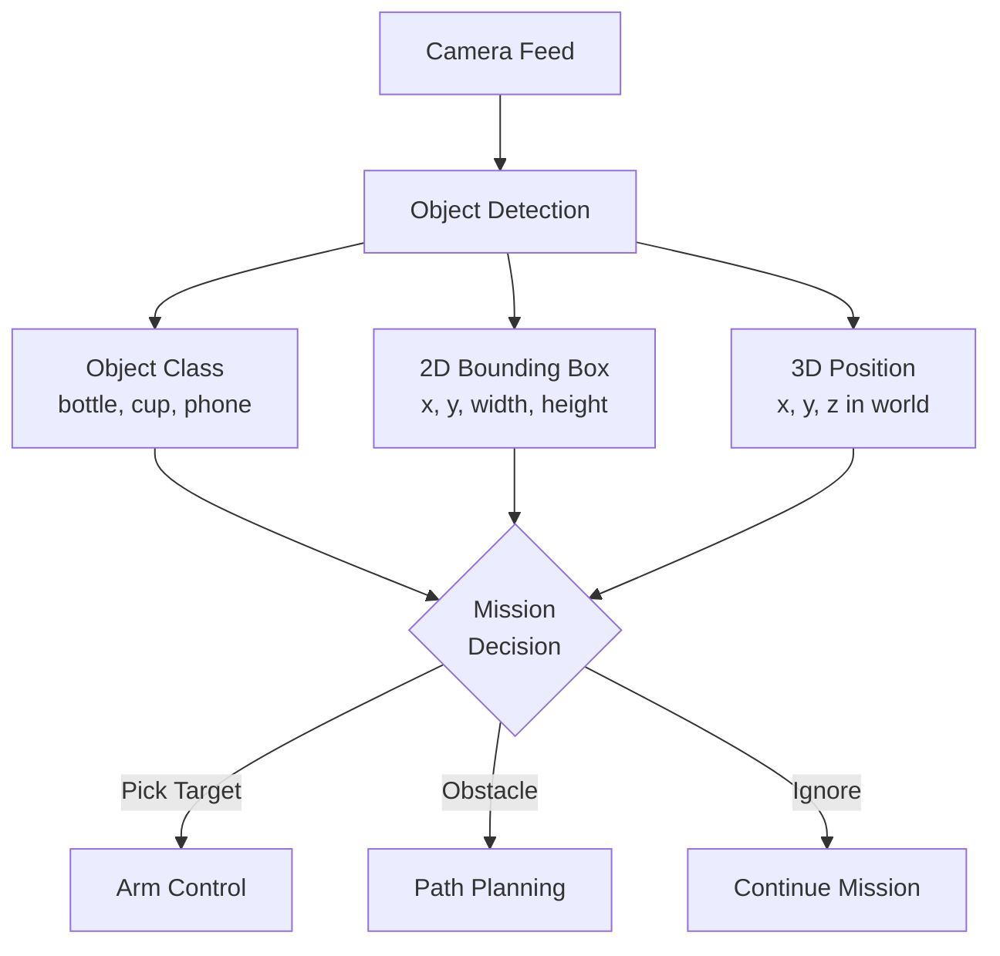
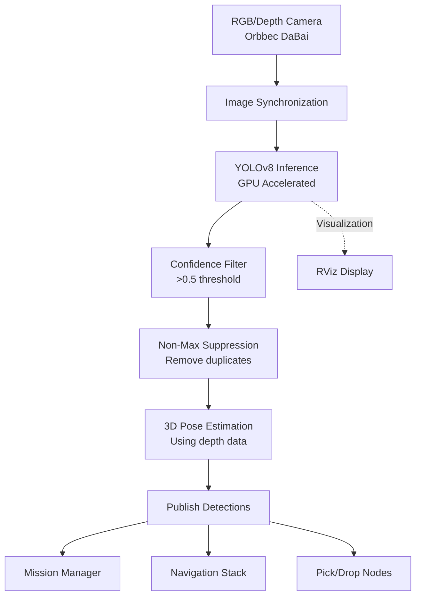

import Admonition from '@theme/Admonition';
import Tabs from '@theme/Tabs';
import TabItem from '@theme/TabItem';

# 👁️ Object Detection Pipeline

Object detection enables your robot to **see and identify objects in the real world**, so it can pick, avoid, or interact with them.  
Your project uses a **YOLO-based detection pipeline** tightly integrated into ROS2 for real-time performance.

---

## 🧠 Object Detection Fundamentals

**Object detection** combines **classification** and **localization**:
- **Classification:** "What is this object?" (bottle, cup, book, etc.)
- **Localization:** "Where is this object?" (bounding box, 3D coordinates)
- **Confidence:** "How sure are we?" (0.0 to 1.0 probability score)

### **Why Object Detection Matters**



<Admonition type="tip" title="Real-Time Requirements">
Your pipeline must be **fast** (>10 FPS) and **reliable**, running directly on embedded hardware like Jetson Orin Nano.
</Admonition>

---

## ⚡ YOLO Implementation

Your project uses **YOLOv8** (You Only Look Once) for state-of-the-art real-time object detection.

### **Why YOLOv8?**

| Feature | Benefit | Alternative |
|---------|---------|-------------|
| **Speed** | 30+ FPS on edge devices | R-CNN (slower) |
| **Accuracy** | mAP 50+ on COCO dataset | SSD (less accurate) |
| **Efficiency** | Single-stage detection | Two-stage detectors |
| **ROS2 Integration** | Easy Python binding | TensorFlow models |

### **Detection Pipeline Architecture**

<Tabs>
<TabItem value="ros2" label="ROS2 Integration" default>

```python
# object_detection_node.py
import rclpy
from rclpy.node import Node
from sensor_msgs.msg import Image, PointCloud2
from geometry_msgs.msg import PoseStamped
from ultralytics import YOLO
import cv_bridge

class ObjectDetectionNode(Node):
    def __init__(self):
        super().__init__('object_detection_node')
        
        # Load YOLOv8 model
        self.model = YOLO('yolov8n.pt')  # or custom weights
        self.bridge = cv_bridge.CvBridge()
        
        # Subscribers
        self.image_sub = self.create_subscription(
            Image, '/camera/color/image_raw', 
            self.image_callback, 10)
        self.depth_sub = self.create_subscription(
            Image, '/camera/depth/image_rect_raw',
            self.depth_callback, 10)
            
        # Publishers
        self.detection_pub = self.create_publisher(
            DetectionArray, '/detections', 10)
        self.pose_pub = self.create_publisher(
            PoseStamped, '/target_pose', 10)
        self.viz_pub = self.create_publisher(
            Image, '/detection_image', 10)
    
    def image_callback(self, msg):
        # Convert ROS image to OpenCV
        cv_image = self.bridge.imgmsg_to_cv2(msg, 'bgr8')
        
        # Run YOLO inference
        results = self.model(cv_image)
        
        # Process detections
        for r in results:
            boxes = r.boxes
            if boxes is not None:
                self.process_detections(boxes, cv_image, msg.header)
    
    def process_detections(self, boxes, image, header):
        detections = DetectionArray()
        detections.header = header
        
        for box in boxes:
            # Extract detection info
            conf = float(box.conf[0])
            cls = int(box.cls[0])
            class_name = self.model.names[cls]
            
            # Filter by confidence
            if conf > 0.5:  # Confidence threshold
                detection = Detection()
                detection.class_name = class_name
                detection.confidence = conf
                detection.bbox = self.extract_bbox(box)
                
                # Estimate 3D position if depth available
                if self.latest_depth is not None:
                    detection.pose = self.estimate_3d_pose(box, self.latest_depth)
                
                detections.detections.append(detection)
        
        # Publish results
        self.detection_pub.publish(detections)
        self.publish_visualization(image, detections)
```

</TabItem>
<TabItem value="pipeline" label="Pipeline Flow">



</TabItem>
<TabItem value="config" label="Configuration">

```yaml
# object_detection_config.yaml
object_detection:
  model:
    weights_path: "models/best.pt"
    device: "cuda"  # or "cpu"
    confidence_threshold: 0.5
    nms_threshold: 0.4
    
  camera:
    rgb_topic: "/camera/color/image_raw"
    depth_topic: "/camera/depth/image_rect_raw"
    camera_info_topic: "/camera/color/camera_info"
    
  publishing:
    detection_topic: "/detections"
    pose_topic: "/target_pose"
    visualization_topic: "/detection_image"
    publish_rate: 10.0  # Hz
    
  filtering:
    target_classes: ["bottle", "cup", "book", "phone", "keys"]
    min_area: 1000  # pixels
    max_area: 50000  # pixels
```

</TabItem>
</Tabs>

---

## 🎯 Training Custom Models

To detect new objects or improve accuracy for your specific environment:

### **Data Collection**

<Tabs>
<TabItem value="collection" label="Image Collection" default>

```bash
# Collect training images using your robot's camera
ros2 launch object_detection collect_training_data.launch.py

# Or manually collect from saved bag files
ros2 bag play training_session.bag
ros2 run image_view image_saver image:=/camera/color/image_raw
```

**Best practices:**
- Collect **1000+ images** per object class
- Include various **lighting conditions**
- Show objects from **different angles**
- Include **cluttered backgrounds**
- Add **occlusion scenarios**

</TabItem>
<TabItem value="annotation" label="Annotation Process">

**Recommended tools:**
- **Roboflow:** Web-based, excellent for YOLO formats
- **CVAT:** Open-source, supports team collaboration
- **LabelImg:** Simple desktop tool for quick annotation

```bash
# Install LabelImg for local annotation
pip install labelimg

# Launch annotation tool
labelimg /path/to/images /path/to/classes.txt
```

**Annotation format (YOLO):**
```
# Each .txt file contains bounding boxes for one image
# Format: class_id center_x center_y width height (normalized 0-1)
0 0.5 0.3 0.2 0.4  # bottle at center-left
1 0.8 0.7 0.15 0.25  # cup at bottom-right
```

</TabItem>
<TabItem value="training" label="Model Training">

```python
# train_custom_model.py
from ultralytics import YOLO

# Load pre-trained model
model = YOLO('yolov8n.pt')

# Train on custom dataset
results = model.train(
    data='config/dataset.yaml',
    epochs=100,
    imgsz=640,
    batch=16,
    device='cuda',
    save_period=10,
    patience=20
)

# Export trained model
model.export(format='onnx')  # For deployment optimization
```

**Dataset configuration:**
```yaml
# dataset.yaml
path: /path/to/dataset
train: images/train
val: images/val
test: images/test

names:
  0: bottle
  1: cup
  2: book
  3: phone
  4: keys
  5: remote
```

</TabItem>
</Tabs>

### **Model Deployment**

```bash
# Copy trained weights to robot
scp runs/detect/train/weights/best.pt robot@limo:/opt/ros2_ws/src/object_detection/models/

# Update configuration
# Edit object_detection_config.yaml to use new weights
weights_path: "models/best.pt"

# Restart detection node
ros2 launch object_detection detection.launch.py
```

---

## 🔗 Detection Pipeline Integration

### **Message Definitions**

```python
# Custom message: Detection.msg
string class_name
float32 confidence
geometry_msgs/Point2D bbox_center
geometry_msgs/Point2D bbox_size
geometry_msgs/PoseStamped pose_3d
bool has_3d_pose

# Custom message: DetectionArray.msg
std_msgs/Header header
Detection[] detections
```

### **3D Pose Estimation**

<Tabs>
<TabItem value="depth" label="Depth-based Estimation" default>

```python
def estimate_3d_pose(self, bbox, depth_image, camera_info):
    """Estimate 3D pose from 2D bounding box and depth data"""
    
    # Get bounding box center
    center_x = int(bbox.center_x * depth_image.shape[1])
    center_y = int(bbox.center_y * depth_image.shape[0])
    
    # Extract depth value (handle noise)
    depth_region = depth_image[center_y-5:center_y+5, center_x-5:center_x+5]
    depth_value = np.median(depth_region[depth_region > 0])
    
    if depth_value == 0:
        return None  # Invalid depth
    
    # Convert to 3D coordinates using camera intrinsics
    fx = camera_info.k[0]  # Focal length X
    fy = camera_info.k[4]  # Focal length Y
    cx = camera_info.k[2]  # Principal point X
    cy = camera_info.k[5]  # Principal point Y
    
    # Calculate 3D position
    x = (center_x - cx) * depth_value / fx
    y = (center_y - cy) * depth_value / fy
    z = depth_value
    
    # Create pose message
    pose = PoseStamped()
    pose.header.frame_id = "camera_depth_optical_frame"
    pose.pose.position.x = x / 1000.0  # Convert mm to m
    pose.pose.position.y = y / 1000.0
    pose.pose.position.z = z / 1000.0
    pose.pose.orientation.w = 1.0  # No rotation info from detection
    
    return pose
```

</TabItem>
<TabItem value="stereo" label="Stereo Vision (Advanced)">

```python
# For dual camera setup or stereo cameras
def stereo_triangulation(self, bbox_left, bbox_right, stereo_params):
    """Calculate 3D position using stereo triangulation"""
    
    # Extract matching points from left and right images
    x1, y1 = bbox_left.center_x, bbox_left.center_y
    x2, y2 = bbox_right.center_x, bbox_right.center_y
    
    # Calculate disparity
    disparity = x1 - x2
    
    if disparity <= 0:
        return None  # Invalid disparity
    
    # Triangulate 3D point
    baseline = stereo_params.baseline
    focal_length = stereo_params.focal_length
    
    z = (baseline * focal_length) / disparity
    x = (x1 - stereo_params.cx) * z / focal_length
    y = (y1 - stereo_params.cy) * z / focal_length
    
    return [x, y, z]
```

</TabItem>
</Tabs>

---

## 📊 Performance Optimization

### **Inference Speed**

| Optimization | Performance Gain | Trade-off |
|-------------|------------------|-----------|
| **TensorRT** | 2-3x faster | Setup complexity |
| **ONNX Runtime** | 1.5x faster | Moderate setup |
| **Model Pruning** | 1.2x faster | Slight accuracy loss |
| **Lower Resolution** | 2x faster | Reduced accuracy |

### **Memory Management**

```python
class OptimizedDetector:
    def __init__(self):
        # Pre-allocate memory for faster inference
        self.input_tensor = torch.zeros((1, 3, 640, 640))
        self.device = torch.device('cuda' if torch.cuda.is_available() else 'cpu')
        
        # Enable mixed precision for speed
        self.scaler = torch.cuda.amp.GradScaler()
        
    def detect_optimized(self, image):
        with torch.cuda.amp.autocast():
            # Preprocess image in-place
            preprocessed = self.preprocess_inplace(image)
            
            # Run inference
            with torch.no_grad():
                results = self.model(preprocessed)
                
            return self.postprocess(results)
```

---

## 🛠️ Troubleshooting & Best Practices

### **Common Issues**

<details>
<summary>🎯 **Low Detection Accuracy**</summary>

**Possible causes:**
- Poor lighting conditions
- Object partially occluded
- Model not trained on similar objects
- Camera focus/calibration issues

**Solutions:**
```python
# Improve preprocessing
def enhance_image(self, image):
    # Histogram equalization for lighting
    lab = cv2.cvtColor(image, cv2.COLOR_BGR2LAB)
    lab[:,:,0] = cv2.createCLAHE(clipLimit=2.0).apply(lab[:,:,0])
    enhanced = cv2.cvtColor(lab, cv2.COLOR_LAB2BGR)
    
    # Gaussian blur to reduce noise
    enhanced = cv2.GaussianBlur(enhanced, (3, 3), 0)
    
    return enhanced

# Multi-scale detection
def multi_scale_detect(self, image):
    results = []
    scales = [0.8, 1.0, 1.2]
    
    for scale in scales:
        resized = cv2.resize(image, None, fx=scale, fy=scale)
        result = self.model(resized)
        results.extend(result)
    
    return self.merge_results(results)
```

</details>

<details>
<summary>⚡ **Performance Issues**</summary>

**Frame rate too low:**
```python
# Optimize detection frequency
class AdaptiveDetector:
    def __init__(self):
        self.detection_interval = 3  # Process every 3rd frame
        self.frame_count = 0
        self.last_detections = []
        
    def process_frame(self, image):
        self.frame_count += 1
        
        if self.frame_count % self.detection_interval == 0:
            # Run detection
            self.last_detections = self.detect(image)
        
        # Always return last known detections
        return self.last_detections
```

</details>

<details>
<summary>🔧 **Integration Issues**</summary>

**Detection not triggering actions:**
```bash
# Debug ROS2 communication
ros2 topic list | grep detection
ros2 topic echo /detections --once
ros2 node info /object_detection_node

# Check message flow
ros2 run rqt_graph rqt_graph

# Monitor detection frequency
ros2 topic hz /detections
```

</details>

---

## 📈 Advanced Features

### **Object Tracking**

```python
class ObjectTracker:
    def __init__(self):
        self.tracker = cv2.TrackerCSRT_create()
        self.tracking_objects = {}
        
    def update_tracking(self, image, detections):
        # Initialize trackers for new objects
        for detection in detections:
            if detection.confidence > 0.8:  # High confidence objects
                tracker_id = self.start_tracking(image, detection.bbox)
                self.tracking_objects[tracker_id] = detection
        
        # Update existing trackers
        for tracker_id, tracker in self.tracking_objects.items():
            success, bbox = tracker.update(image)
            if success:
                self.update_object_pose(tracker_id, bbox)
```

### **Multi-Class Strategy**

```python
# Priority-based detection for mission planning
OBJECT_PRIORITIES = {
    'target_item': 1,      # Highest priority
    'obstacle': 2,         # Avoid these
    'reference': 3,        # For localization
    'background': 4        # Ignore these
}

def prioritize_detections(self, detections):
    # Sort by priority, then confidence
    return sorted(detections, 
                 key=lambda d: (OBJECT_PRIORITIES.get(d.class_name, 5), 
                               -d.confidence))
```

---

## 📊 Output Topics & Integration

### **Published Topics**

| Topic | Message Type | Frequency | Description |
|-------|-------------|-----------|-------------|
| `/detections` | `DetectionArray` | 10 Hz | All detected objects |
| `/target_pose` | `PoseStamped` | On detection | 3D pose of target object |
| `/detection_image` | `Image` | 10 Hz | Visualization with bounding boxes |
| `/detection_status` | `std_msgs/String` | 1 Hz | System status and errors |

### **Integration Example**

```python
# mission_manager.py - Using detections
class MissionManager(Node):
    def __init__(self):
        self.detection_sub = self.create_subscription(
            DetectionArray, '/detections', 
            self.detection_callback, 10)
            
    def detection_callback(self, msg):
        for detection in msg.detections:
            if detection.class_name == "target_bottle":
                if detection.confidence > 0.8:
                    # Trigger pick sequence
                    self.request_pickup(detection.pose_3d)
                    break
```

---

## 📚 Learn More

- [YOLOv8 Official Documentation](https://docs.ultralytics.com/)
- [ROS2 Computer Vision Tutorials](https://docs.ros.org/en/humble/Tutorials/Advanced/Computer-Vision.html)
- [OpenCV Python Documentation](https://docs.opencv.org/4.x/d6/d00/tutorial_py_root.html)
- [Roboflow Training Platform](https://roboflow.com/)
- [Object Detection Metrics Guide](https://jonathan-hui.medium.com/map-mean-average-precision-for-object-detection-45c121a31173)

---

## 🎯 Next Steps

<Admonition type="note" title="Ready for Integration?">

Now that you understand object detection:

- **Integration:** [System Integration](./system-integration.md)
- **Implementation:** [Object Detection Node](../system-components/object-detection-node.md)
- **Advanced:** [Custom Object Training](../advanced-usage/custom-objects.md)
- **Troubleshooting:** [Detection Issues](../troubleshooting/debugging-guide.md)

</Admonition>
