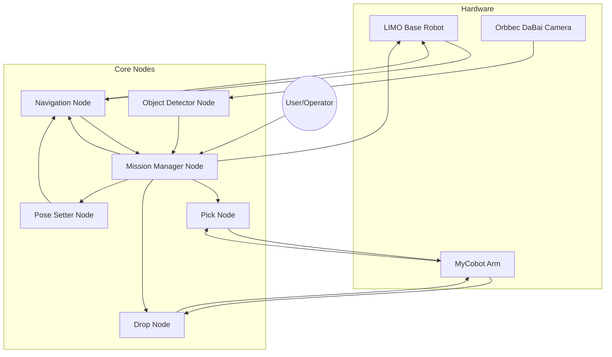

import Tabs from '@theme/Tabs';
import TabItem from '@theme/TabItem';
import Admonition from '@theme/Admonition';
import Mermaid from '@theme/Mermaid';

# 🔗 System Integration

How does all your code, hardware, and ROS2 nodes actually work together?  
This page shows how **your custom logic, third-party packages, and real hardware** connect in a single ROS2 ecosystem.

---

## 🧩 How Your Code Fits into ROS2

Your project is a classic **ROS2 modular system**:
- Each function (detection, navigation, manipulation, state management) is a separate **node**.
- Nodes interact via **topics**, **services**, and **actions**.
- The **mission manager node** acts as the “brain,” coordinating everything and handling real-time events.

<Admonition type="info" title="Tip">
  “Think of every major box in your system as a separate node. Each node is replaceable, debuggable, and testable on its own.”
</Admonition>

---

## 🗺️ System Integration Diagram

---

## 🔄 Communication Patterns

| Pattern          | Example in Your Project                                         |
|------------------|-----------------------------------------------------------------|
| **Topic**        | `/target_pose` from Detector → Mission Manager                  |
| **Action**       | Navigation goals via `nav2_msgs/action/NavigateToPose`          |
| **Service**      | (Optional) Reset, trigger, parameter tuning                     |
| **Parameter**    | Launch configs, runtime tuning (e.g., thresholds, IP addresses) |
| **TF Frames**    | Camera, base_link, map, arm, all dynamically linked             |

**Typical Flow:**  
1. **Robot explores via Navigation Node**  
2. **Object Detector** publishes `/target_pose` on detection  
3. **Mission Manager** interrupts navigation, coordinates approach, triggers pick/drop nodes  
4. **Pick/Drop Node** interacts with MyCobot, Mission resumes or returns  
5. **All state and pose info flows through topics or actions**

---

## ⚡️ System Coordination Example

<Tabs>
  <TabItem value="Normal Operation" label="Normal Operation" default>
  1. Launch all nodes with `full_system.launch.py`
  2. Robot starts exploring waypoints
  3. Object is detected: `/target_pose` published
  4. Mission Manager:
      - Pauses exploration
      - Sends goal to Navigation Node
      - On arrival: triggers Pick Node
      - Waits for success/failure
      - Sends “return to base” goal
      - Triggers Drop Node
      - Resumes or finishes
  </TabItem>
  <TabItem value="Interrupt & Error Handling" label="Interrupt & Error Handling">
  - If Pick fails: Mission Manager reports error, may retry or abort
  - If object detection is unstable: resumes exploration, waits for new target
  - All errors logged, state managed in Mission Manager Node
  </TabItem>
</Tabs>

---

## 🕸️ How Each Node Communicates

| Node              | Publishes                  | Subscribes to            | Actions/Services        |
|-------------------|---------------------------|--------------------------|-------------------------|
| Object Detector   | `/target_pose`            | Camera, Depth topics     | —                       |
| Mission Manager   | Navigation goal, `/cmd_vel`| `/target_pose`, feedback | Triggers pick/drop      |
| Navigation Node   | Robot movement            | Goal poses               | `NavigateToPose` action |
| Pick/Drop Node    | Arm/gripper commands      | Trigger from Mission     | —                       |
| Pose Setter       | Initial pose to Nav Node  | Manual or launch         | —                       |

---

## 👨‍💻 System Integration Best Practices

- Use **launch files** to manage startup dependencies and correct launch order (see `full_system.launch.py`)
- Keep all custom code in your external workspace
- Use **actions** for long-running tasks (navigation, arm movement), **topics** for rapid data/events
- Always test each node individually before full system bring-up
- Use **RQT Graph** and **RViz** to debug connections and visualize state

---

## 🚦 Next Steps

- [System Usage: Running Everything](../usage-guide/system-startup.md)
- [Advanced Integration & Customization](../advanced-usage/custom-objects.md)
- [Troubleshooting](../troubleshooting/debugging-guide.md)

---
