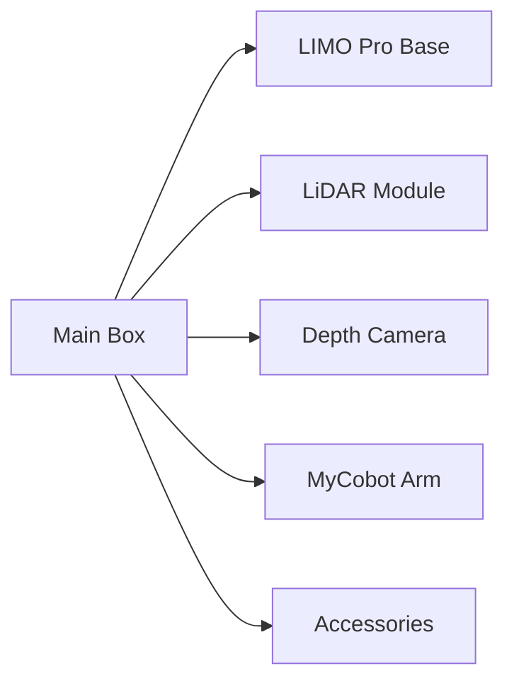

import Admonition from '@theme/Admonition';
import Tabs from '@theme/Tabs';
import TabItem from '@theme/TabItem';
import Mermaid from '@theme/Mermaid';

# 📦 Hardware Unboxing

The first step of your robotics journey starts with that **shiny, sealed box**.  
Let’s unpack the magic and see what makes the LIMO + MyCobot system such a powerful combo.

---

## ✨ First Impressions

<Admonition type="info" title="Pro Tip">
  Handle everything with care — these are precision components. Keep all packaging for transport and warranty purposes.
</Admonition>

When you first open the package, you’ll find a **perfectly organized kit**, with every component neatly packed for safety and convenience.

---

## 📦 What’s in the Box?

<Tabs>
  <TabItem value="LIMO Pro Kit" label="LIMO Pro Kit" default>
  - **LIMO Pro Robot Base**
    - Integrated motor system
    - Onboard battery
    - Pre-flashed control board
  - **LiDAR Module**
  - **Orbbec DaBai Depth Camera**
  - **WiFi Antenna**
  - **Power Adapter + Charging Cable**
  - **Allen Key Set & Mounting Screws**
  - **User Quick Start Guide**
  </TabItem>
  <TabItem value="MyCobot Arm Kit" label="MyCobot Arm Kit">
  - **MyCobot 280/320 Arm**
  - **Gripper Attachment**
  - **WiFi Control Module**
  - **USB Cable (Data & Power)**
  - **Calibration Card**
  - **Mounting Plate & Screws**
  </TabItem>
  <TabItem value="Accessories" label="Accessories">
  - Spare mounting screws
  - USB to Ethernet adapter (optional)
  - SD card (preloaded with OS)
  - Safety power switch
  </TabItem>
</Tabs>

---

## 🖼️ Unboxing Layout Diagram

---

## 🛠️ Before You Power On

1. **Inspect each item** for shipping damage  
2. **Check for all listed components** — cross-check with the packing list  
3. **Charge the LIMO battery fully** before first use  
4. Keep the arm **in its foam padding** until ready to mount

<Admonition type="warning" title="Important">
  Never connect or disconnect electronics while the system is powered ON — you can damage sensitive components.
</Admonition>

---

## 💡 Pro Tips for Setup Day

- **Photograph your setup** after unboxing — helps in reassembly
- **Label cables** with tags for easy troubleshooting later
- **Store the original box** — invaluable for shipping/transport
- Install all hardware **before** running any software tests

---

## 🎯 Next Steps

- [ROS2 Workspace Setup](../environment-setup/ros2-workspace.md)
- [System Components Overview](../system-components/overview.md)
- [Configuration](../environment-setup/configuration.md)
- [Installing Code](./installing-code.md)

---
