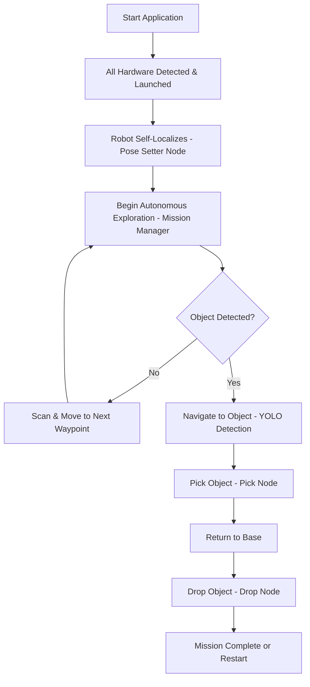

# 🔄 High-Level Workflow

This is the **full pipeline** of LIMO Cobot—from power-up to “mission complete.”  
See how every part fits together and what you should expect at each stage.

## 🎯 Workflow Stages Explained

### 🚀 **Initialization Phase**
- **Hardware Detection**: All components (LIMO base, MyCobot arm, camera) are detected and initialized
- **Self-Localization**: Robot determines its position on the map using AMCL and pose estimation

### 🔍 **Exploration Phase**  
- **Autonomous Navigation**: Robot follows pre-defined or generated waypoints
- **Object Scanning**: YOLOv8 continuously analyzes camera feed for target objects
- **Adaptive Pathfinding**: Nav2 handles dynamic obstacle avoidance

### 🦾 **Manipulation Phase**
- **Approach**: Robot navigates to optimal pick position relative to detected object
- **Pick Operation**: MyCobot arm executes precise grasping sequence
- **Transport**: Robot safely carries object back to designated drop zone

### ✅ **Completion Phase**
- **Drop Operation**: Controlled object placement at base location
- **Mission Assessment**: System evaluates success and logs performance
- **Restart**: Cycle repeats for additional objects or ends based on configuration

## 🔄 Error Handling & Recovery

Each stage includes robust error handling:
- **Navigation failures** trigger re-planning or alternative routes
- **Pick failures** initiate retry sequences with adjusted parameters  
- **Communication timeouts** activate failsafe modes
- **Hardware issues** generate alerts and graceful degradation
