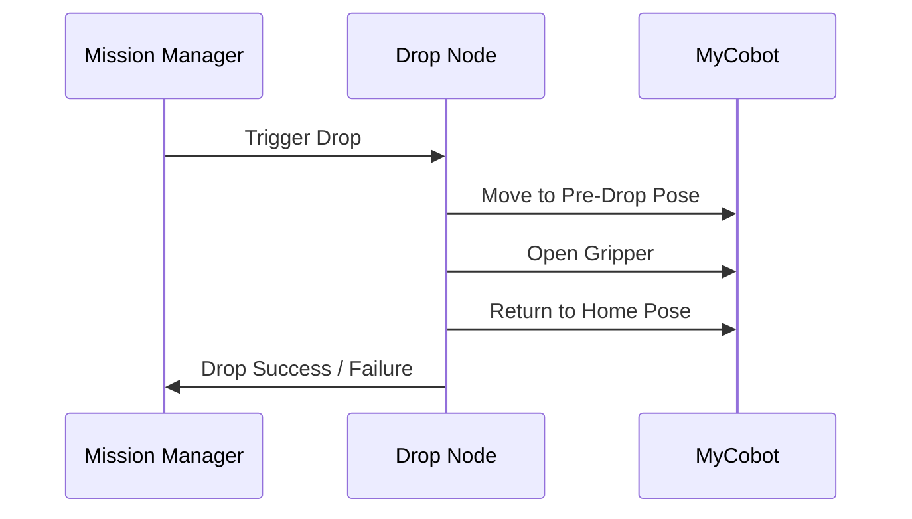

import Admonition from '@theme/Admonition';
import Tabs from '@theme/Tabs';
import TabItem from '@theme/TabItem';

# 📦 Drop Node

The **Drop Node** is responsible for releasing the object at a designated location (drop zone) with precision and safety.  
It works closely with the **Mission Manager** to complete the final stage of an object-handling task.

---

## 🔄 Drop Operation Workflow

1. **Receive trigger** from Mission Manager (`/drop_trigger` or action call).
2. Navigate robot to **drop zone coordinates** (predefined or dynamic).
3. Move arm to **pre-drop pose** (safe above drop location).
4. Open gripper to release object.
5. Move arm back to **home position**.
6. Confirm drop completion to Mission Manager.

---

## 🎯 Positioning & Accuracy

- **Base Pose:**  
  The robot returns to a fixed base pose before dropping. This ensures consistent accuracy by aligning the arm with the drop zone.

- **Pose Calibration:**  
  - Align the arm’s coordinate frame with the robot’s base_link.
  - Use measured offsets to ensure the gripper is centered over the drop area.

<Admonition type="tip" title="Pro Tip">
  Always perform a one-time calibration for the drop pose after hardware changes.
</Admonition>

---

## 🛡 Safety Mechanisms

| Safety Feature         | Purpose                                     |
|------------------------|---------------------------------------------|
| Pre-drop safe height   | Prevents collisions during approach         |
| Collision limits       | Stops arm if unexpected resistance is felt  |
| Timed gripper control  | Avoids overdriving servo motors             |
| Home position reset    | Ensures arm is safely stowed after drop     |

---

## 🧪 Testing Procedures

**Step-by-step:**
1. **Dry Run:**  
   Run drop sequence without holding an object — verify arm paths.
2. **Low-Speed Test:**  
   Hold a lightweight object and run the sequence slowly.
3. **Load Test:**  
   Drop real objects at operational speed.
4. **Repeatability Test:**  
   Drop 10+ times and measure deviation from target.

**Pass Criteria:**
- Drop point within ±2 cm of target.
- Arm returns to home position safely.
- No collisions or grip failures.

---

## 🚀 Performance Optimization

- **Reduce approach time:**  
  Move arm in a single smooth motion from transport pose to pre-drop pose.
- **Use fixed drop offsets:**  
  Avoid re-calculating positions each time.
- **Tune joint speeds:**  
  Increase joint velocity for faster cycles (while staying safe).
- **Parallelize:**  
  Prepare next navigation goal while arm returns to home.

---

## 🛠 Troubleshooting

| Issue                         | Possible Cause                           | Solution |
|--------------------------------|-------------------------------------------|----------|
| Object misses drop area        | Incorrect calibration or offsets          | Recalibrate drop pose |
| Arm collides with environment  | Pre-drop height too low                   | Increase Z offset |
| Gripper fails to open          | Servo issue or wrong topic/service name   | Test gripper manually |
| Arm stuck after drop           | Missing return-to-home command            | Add home pose command |

---

## 📚 Learn More

- [MyCobot ROS2 Documentation](https://github.com/elephantrobotics/mycobot_ros2)
- [ROS2 Actions & Services](https://docs.ros.org/en/foxy/Tutorials/Services/Services.html)
- [MoveIt2 Planning & Execution](https://moveit.ros.org/)

---

## 🎯 Next Steps

- [Pick Node](./pick-node.md)
- [Mission Manager Node](./mission-manager.md)
- [System Integration](../core-concepts/system-integration.md)

---
