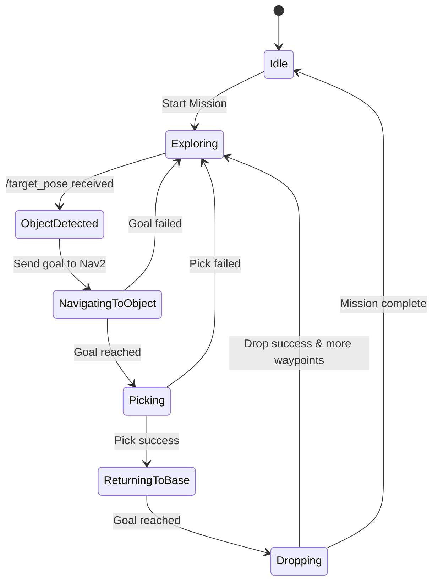

import Admonition from '@theme/Admonition';
import Tabs from '@theme/Tabs';
import TabItem from '@theme/TabItem';

# 🧠 Mission Manager Node

The **Mission Manager Node** is the central coordinator — it decides **what the robot should do next**, manages state transitions, and ensures smooth integration between perception, navigation, and manipulation.

---

## 🔄 State Machine Overview

The Mission Manager operates as a **finite state machine (FSM)**.  
Each state represents a high-level behavior, with transitions triggered by events like detections, goal completions, or errors.



---

## 🚨 Interrupt Logic

The Mission Manager can **interrupt ongoing navigation** when:
- A valid `/target_pose` is published by the Object Detector
- The detected object matches configured class filters
- Confidence exceeds a threshold

**Interrupt flow:**
1. Cancel current waypoint navigation
2. Store the interrupted goal (optional resume)
3. Send navigation goal to the detected object's position
4. After pick/drop, return to base or resume waypoints

<Admonition type="info" title="Pro Tip">
Interrupts are rate-limited — if multiple detections occur quickly, only the most recent high-confidence one is used.
</Admonition>

---

## 🛠 System Orchestration

The Mission Manager coordinates:

| Task                      | How It's Done                                                   |
|---------------------------|-----------------------------------------------------------------|
| **Exploration**           | Sends sequential waypoint goals to Nav2                        |
| **Object Handling**       | Listens for `/target_pose` from Object Detector                 |
| **Navigation Control**    | Uses `nav2_msgs/action/NavigateToPose`                          |
| **Pick/Place Control**    | Sends triggers to Pick & Drop Nodes                             |
| **State Feedback**        | Logs progress and plays audio feedback (optional)               |
| **Error Recovery**        | Retries goals, skips failed steps, logs errors                  |

---

## ⚙️ Configuration Options

In `mission_manager.py` or launch params:

| Parameter            | Description                                         | Default   |
|----------------------|-----------------------------------------------------|-----------|
| `waypoints`          | List of (x, y, yaw) navigation goals                | See nav_handler |
| `base_pose`          | Coordinates of drop zone / home                     | Set in pose_setter |
| `object_class_filter`| Only trigger on specific detected classes            | None      |
| `confidence_threshold`| Minimum YOLO confidence to trigger                  | 0.7       |
| `nav_goal_timeout`   | Seconds to wait for navigation before skipping      | 10        |
| `pick_timeout`       | Seconds to wait for pick operation before skipping  | 15        |
| `drop_timeout`       | Seconds to wait for drop operation before skipping  | 15        |

---

## 📜 Sample Output & Logs

<Tabs>
  <TabItem value="normal" label="Normal Run" default>
  ```plaintext
  [mission_manager]: 🟢 Exploration started.
  [mission_manager]: 🚀 Navigating to waypoint: (0.37, -0.10, -13.3°)
  [mission_manager]: 📸 Object detected: bottle (conf=0.85) at (1.25, -0.45)
  [mission_manager]: ⏹ Interrupting navigation for object pickup.
  [mission_manager]: 🚀 Navigating to: (1.25, -0.45)
  [mission_manager]: 🤖 Pick successful.
  [mission_manager]: 🚗 Returning to base: (1.95, -9.86)
  [mission_manager]: 📦 Drop successful.
  [mission_manager]: 🔄 Resuming waypoint navigation.
  ```
  </TabItem>
  <TabItem value="error" label="Error Handling">
  ```plaintext
  [mission_manager]: 📸 Object detected: bottle (conf=0.62) — below threshold, ignoring.
  [mission_manager]: ❌ Navigation goal timed out — skipping to next waypoint.
  [mission_manager]: ❌ Pick failed — resuming exploration.
  ```
  </TabItem>
</Tabs>

---

## 🧩 Integration Points

| From | To | Data / Action |
|------|----|--------------| 
| Object Detector | Mission Manager | `/target_pose` (PoseStamped) |
| Mission Manager | Nav2 | NavigateToPose action goal |
| Mission Manager | Pick/Drop Nodes | Service/Topic trigger |
| Nav2 | Mission Manager | Action feedback/result |

---

## 🛠 Troubleshooting

| Issue | Possible Cause | Solution |
|-------|---------------|----------|
| Ignores detections | Class filter or confidence threshold too high | Lower threshold in config |
| Doesn't resume waypoints after pick | Missing resume logic | Check mission_manager code path |
| Navigation never cancels on detect | Cancel action call not working | Ensure correct Nav2 cancel API usage |
| Mission stuck in pick/drop | Pick/Drop nodes not returning completion flag | Debug pick/drop node logic |

---

## 📚 Learn More

- [ROS2 Actions Tutorial](https://docs.ros.org/en/foxy/Tutorials/Understanding-ROS2-Actions.html)
- [Nav2 Waypoint Following](https://navigation.ros.org/tutorials/docs/navigation2_with_keepout_filter.html)
- [Finite State Machines in Robotics](https://wiki.ros.org/smach)

---

## 🎯 Next Steps

- [System Integration](../core-concepts/system-integration.md)
- [Pick & Drop Node](./pick-node.md)
- [Object Detection Node](./object-detection-node.md)
