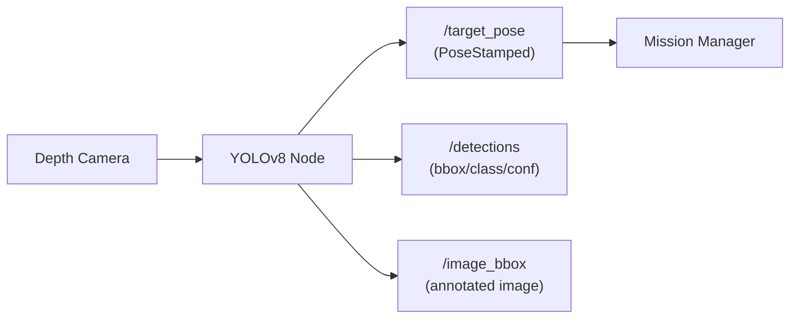

import Admonition from '@theme/Admonition';
import Tabs from '@theme/Tabs';
import TabItem from '@theme/TabItem';

# 🟩 Object Detection Node

The **Object Detection Node** is the vision brain of your robot — it processes images from the onboard camera, detects objects using YOLOv8, estimates their positions, and publishes them to ROS2 so other nodes (like navigation and manipulation) can act.

---

## 🔍 What It Does & How It Works

1. **Subscribes** to RGB and depth image topics from the Orbbec DaBai depth camera.
2. **Runs YOLOv8 inference** on each frame to detect objects in real time.
3. **Estimates 3D positions** of detected objects using depth data.
4. **Publishes detections**:
   - `/target_pose` → `geometry_msgs/PoseStamped` (used by Mission Manager & Navigation)
   - `/detections` → list of bounding boxes, class names, confidence scores
   - `/image_bbox` → image with overlayed detection boxes and labels



---

## ⚙️ Setup & Configuration

### **1. Requirements**
- Python ≥ 3.8
- ROS2 Foxy workspace
- Ultralytics YOLOv8 installed
- Depth camera drivers running

### **2. Installation**
Clone the object detector package into your workspace:
```bash
cd ~/limo_ws/src
git clone https://github.com/your-org/object_detector.git
cd ~/limo_ws
colcon build
source install/setup.bash
```

### **3. Configuration Parameters**
Inside `object_detector.py`:

```python
MIN_DEPTH_METERS = 0.15     # Ignore objects closer than 15cm
MAX_DEPTH_METERS = 4.0      # Ignore objects further than 4m
APPROACH_DIST   = 0.30      # Distance to stop before object
YOLO_WEIGHTS    = "runs/detect/train/weights/best.pt"
```

You can adjust these values in the launch file or node parameters.

---

## ▶️ Usage Instructions

**Start the camera drivers:**
```bash
ros2 launch orbbec_camera dabai.launch.py
```

**Run the Object Detection Node:**
```bash
ros2 run object_detector object_detector_node
```

**Verify outputs:**
- View annotated detections in RViz or `rqt_image_view`
- Monitor detection topic:
```bash
ros2 topic echo /detections
```

<Admonition type="tip" title="Pro Tip">
For full autonomous mode, launch with `full_system.launch.py` — it will auto-start the detector and integrate with navigation/manipulation.
</Admonition>

---

## 🎯 Training Your Own YOLO Model

To detect new objects:

### **1. Collect Images**
- Use the robot camera or a smartphone
- Capture from multiple angles, lighting conditions, and distances

### **2. Label Data**
- Use LabelImg or Roboflow

### **3. Train YOLOv8**
```bash
yolo task=detect mode=train model=yolov8n.pt data=your_data.yaml epochs=50 imgsz=640
```

### **4. Deploy Weights**
- Copy `best.pt` to the robot
- Update `YOLO_WEIGHTS` path in `object_detector.py` or launch file

---

## 🛠 Troubleshooting Tips

| Problem | Possible Cause | Solution |
|---------|---------------|----------|
| No detections | Wrong weights or incorrect camera topic | Check `YOLO_WEIGHTS` path & camera topics |
| Poor accuracy | Dataset too small / poorly labeled | Collect more varied training data |
| Depth pose is wrong | Depth/RGB not synced | Use message filters for synchronized topics |
| Slow FPS | Model too large for hardware | Use smaller YOLO model (e.g., `yolov8n.pt`) |
| Node crashes on startup | Missing dependencies | Reinstall ultralytics & required packages |

<Admonition type="warning" title="Important">
Always verify your depth alignment and TF transforms — incorrect transforms will cause wrong navigation goals.
</Admonition>

---

## 📚 Learn More

- [Ultralytics YOLOv8 Docs](https://docs.ultralytics.com/)
- [ROS2 Image Transport](https://github.com/ros-perception/image_transport_tutorials)
- [ROS2 Custom Messages](https://docs.ros.org/en/foxy/Tutorials/Custom-ROS2-Interfaces.html)

---

## 🎯 Next Steps

- [Object Detection Pipeline](../core-concepts/object-detection.md)
- [System Integration](../core-concepts/system-integration.md)
- [Pick & Place with Detected Objects](../advanced-usage/waypoint-management.md)
