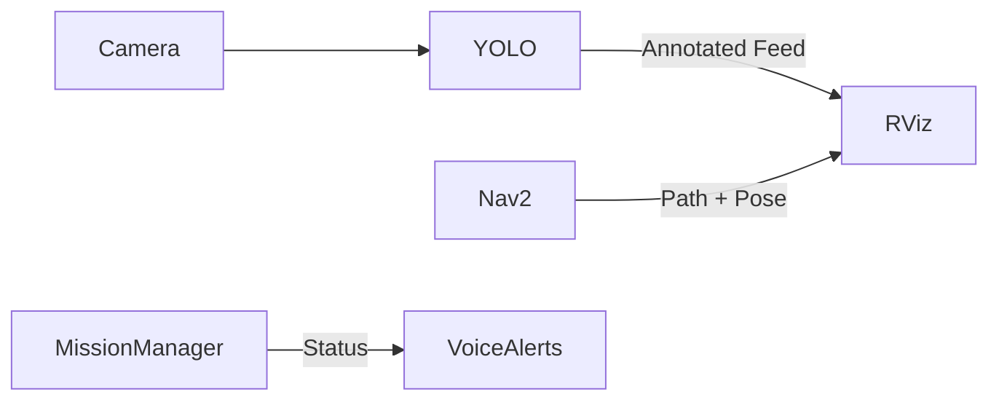

import Tabs from '@theme/Tabs';
import TabItem from '@theme/TabItem';
import Admonition from '@theme/Admonition';

# 📡 Monitoring

Real-time monitoring is critical for ensuring your **LIMO Autonomous System** runs smoothly, detecting issues early, and maintaining performance throughout a mission.

---

## 🛠 System Monitoring Tools

| Tool | Purpose | Usage |
|------|---------|-------|
| **`rqt_graph`** | Visualize ROS 2 node-topic connections | `ros2 run rqt_graph rqt_graph` |
| **`rqt_image_view`** | Live camera and YOLO annotated feed | `ros2 run rqt_image_view rqt_image_view` |
| **`rviz2`** | Visualize navigation map, robot pose, goals | `rviz2` |
| **`htop`** | CPU/RAM monitoring | `htop` |
| **`nvidia-smi`** *(if GPU)* | GPU utilization for YOLO inference | `watch -n 1 nvidia-smi` |

<Admonition type="tip" title="Pro Tip">
Keep `rqt_graph` open during first runs — it helps you see if topics like `/target_pose` or `/amcl_pose` stop publishing unexpectedly.
</Admonition>

---

## 📜 Log Analysis

<Tabs>
<TabItem value="live" label="Live Logs">
```bash
ros2 launch nav_handler full_system.launch.py | tee mission.log
```
</TabItem>

<TabItem value="filter" label="Filter for Warnings/Errors">
```bash
grep -E "WARN|ERROR|FAIL|❌" mission.log
```
</TabItem>

<TabItem value="follow" label="Follow Running Logs">
```bash
ros2 run rclpy logging_example  # or equivalent log subscriber
```
</TabItem>
</Tabs>

**Key log events to track:**
- `🟢 Exploration node ready` → System initialized
- `Object detected.` → YOLO detection triggered
- `🏁 Arrived at object location.` → Navigation to object successful
- `✅ Pick sequence complete!` / `✅ Drop sequence complete!` → Arm operations succeeded
- `❌ Nav2 server not ready!` / `❌ Goal rejected.` → Navigation failure indicators

---

## 📊 Performance Metrics

You can benchmark your system with built-in ROS 2 tools:

| Metric | Command | Good Threshold |
|--------|---------|----------------|
| Camera FPS | `ros2 topic hz /camera/color/image_raw` | ≥ 15 FPS |
| YOLO Detection Latency | Measure log timestamp diff between `/object_found` and `/target_pose` publish | < 1s |
| Nav2 Navigation Time | Compare `/navigate_to_pose` goal sent vs. Goal reached log | Depends on waypoint distance |
| Arm Action Duration | Time from "Starting pick operation" to "Pick done" | ≤ 5s in test setup |

**Example FPS check:**
```bash
ros2 topic hz /yolo/annotated
```

---

## 🚨 Alert Systems

While your current setup uses voice alerts via `espeak`, you can add extra monitoring:

### **Voice Alerts (already implemented):**
- "Navigating"
- "Object detected"
- "Pick done. Returning to base"
- "Drop done. Mission complete"

### **Custom ROS 2 Topic Alerts:**
Publish to `/system_alert` when:
- CPU > 90%
- YOLO fails to detect for > 60s
- Nav2 goal fails

### **Email/Slack Notifications (advanced):**
Use a ROS 2 subscriber node to forward critical alerts to a webhook.

<Admonition type="info" title="Future Upgrade">
Integrate **`ros2_health_monitor`** or a custom diagnostic aggregator for centralized error reporting.
</Admonition>

---

## 📈 Suggested RViz Monitoring Layout

- **Map view:** `/map`, `/amcl_pose`, `/path`
- **Robot model:** `/tf`, `/tf_static`
- **Camera feed:** `/yolo/annotated`
- **Navigation goals:** `/target_pose`



---

## 🎯 Next Steps

- [Performance Tuning](../advanced-usage/custom-objects.md)
- [System Components Overview](../system-components/overview.md)
- [Troubleshooting Guide](../troubleshooting/common-errors.md)
